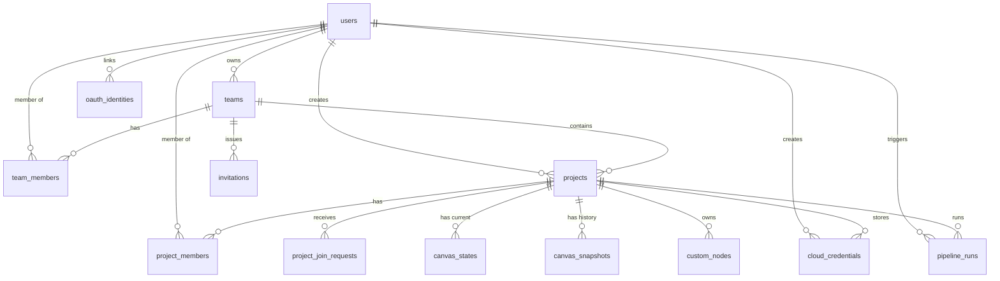

# 01.3 - Data Models & SQLite Schema

## Database Architecture

InfraCanvas stores all application state, authentication data, organization memberships, projects, visual canvas graphs, snapshots, and encrypted credentials in a local SQLite database located at `apps/api/data/dev.db`.

### Driver Selection: `modernc.org/sqlite`
Rather than using `mattn/go-sqlite3` (which relies on CGO and requires gcc/MinGW toolchains that frequently break on Windows or in minimal Docker containers), InfraCanvas uses `modernc.org/sqlite` — a pure Go translation of SQLite that compiles natively across all platforms with zero C toolchain requirements.

---

## Entity Relationship Diagram (ERD)



---

## Detailed Table Schemas

### 1. `users`
Stores user identity, authentication hashes, and billing tier.
```sql
CREATE TABLE IF NOT EXISTS users (
    id TEXT PRIMARY KEY,
    email TEXT UNIQUE NOT NULL,
    password_hash TEXT, -- Nullable for OAuth-only users
    name TEXT NOT NULL,
    plan TEXT NOT NULL DEFAULT 'FREE' CHECK (plan IN ('FREE', 'PRO', 'ENTERPRISE')),
    created_at DATETIME DEFAULT CURRENT_TIMESTAMP
);
```

### 2. `teams`
Multi-tenant organization boundary.
```sql
CREATE TABLE IF NOT EXISTS teams (
    id TEXT PRIMARY KEY,
    name TEXT NOT NULL,
    slug TEXT UNIQUE NOT NULL,
    owner_id TEXT NOT NULL,
    created_at DATETIME DEFAULT CURRENT_TIMESTAMP,
    FOREIGN KEY (owner_id) REFERENCES users(id) ON DELETE RESTRICT
);
```

### 3. `team_members`
Role assignment within a team (`OWNER`, `ADMIN`, `MEMBER`).
```sql
CREATE TABLE IF NOT EXISTS team_members (
    id TEXT PRIMARY KEY,
    team_id TEXT NOT NULL,
    user_id TEXT NOT NULL,
    role TEXT NOT NULL CHECK (role IN ('OWNER', 'ADMIN', 'MEMBER')),
    joined_at DATETIME DEFAULT CURRENT_TIMESTAMP,
    UNIQUE(team_id, user_id),
    FOREIGN KEY (team_id) REFERENCES teams(id) ON DELETE CASCADE,
    FOREIGN KEY (user_id) REFERENCES users(id) ON DELETE CASCADE
);
```

### 4. `projects`
Workspaces containing canvas graphs, credentials, and pipeline runs.
```sql
CREATE TABLE IF NOT EXISTS projects (
    id TEXT PRIMARY KEY,
    team_id TEXT NOT NULL,
    name TEXT NOT NULL,
    description TEXT,
    visibility TEXT NOT NULL DEFAULT 'PRIVATE' CHECK (visibility IN ('PRIVATE', 'TEAM', 'PUBLIC')),
    created_by TEXT NOT NULL,
    created_at DATETIME DEFAULT CURRENT_TIMESTAMP,
    updated_at DATETIME DEFAULT CURRENT_TIMESTAMP,
    FOREIGN KEY (team_id) REFERENCES teams(id) ON DELETE CASCADE,
    FOREIGN KEY (created_by) REFERENCES users(id) ON DELETE RESTRICT
);
```

### 5. `project_members`
Direct RBAC assignments at the project level (`ADMIN`, `EDITOR`, `VIEWER`).
```sql
CREATE TABLE IF NOT EXISTS project_members (
    id TEXT PRIMARY KEY,
    project_id TEXT NOT NULL,
    user_id TEXT NOT NULL,
    role TEXT NOT NULL CHECK (role IN ('ADMIN', 'EDITOR', 'VIEWER')),
    added_by TEXT NOT NULL,
    joined_at DATETIME DEFAULT CURRENT_TIMESTAMP,
    UNIQUE(project_id, user_id),
    FOREIGN KEY (project_id) REFERENCES projects(id) ON DELETE CASCADE,
    FOREIGN KEY (user_id) REFERENCES users(id) ON DELETE CASCADE
);
```

### 6. `project_join_requests`
Discovery workflow requests for public or team projects.
```sql
CREATE TABLE IF NOT EXISTS project_join_requests (
    id TEXT PRIMARY KEY,
    project_id TEXT NOT NULL,
    user_id TEXT NOT NULL,
    status TEXT NOT NULL DEFAULT 'PENDING' CHECK (status IN ('PENDING', 'APPROVED', 'REJECTED')),
    note TEXT,
    reviewed_by TEXT,
    requested_at DATETIME DEFAULT CURRENT_TIMESTAMP,
    reviewed_at DATETIME,
    UNIQUE(project_id, user_id, status),
    FOREIGN KEY (project_id) REFERENCES projects(id) ON DELETE CASCADE,
    FOREIGN KEY (user_id) REFERENCES users(id) ON DELETE CASCADE
);
```

### 7. `invitations`
Email invitation tokens for onboarding collaborators.
```sql
CREATE TABLE IF NOT EXISTS invitations (
    id TEXT PRIMARY KEY,
    team_id TEXT NOT NULL,
    project_id TEXT,
    email TEXT NOT NULL,
    role TEXT NOT NULL,
    token TEXT UNIQUE NOT NULL,
    status TEXT NOT NULL DEFAULT 'PENDING' CHECK (status IN ('PENDING', 'ACCEPTED', 'EXPIRED')),
    invited_by TEXT NOT NULL,
    expires_at DATETIME NOT NULL,
    created_at DATETIME DEFAULT CURRENT_TIMESTAMP,
    FOREIGN KEY (team_id) REFERENCES teams(id) ON DELETE CASCADE,
    FOREIGN KEY (invited_by) REFERENCES users(id) ON DELETE CASCADE
);
```

### 8. `canvas_states`
Active visual workspace state with optimistic concurrency control.
```sql
CREATE TABLE IF NOT EXISTS canvas_states (
    project_id TEXT PRIMARY KEY,
    version INTEGER NOT NULL DEFAULT 1,
    nodes_json TEXT NOT NULL,
    edges_json TEXT NOT NULL,
    viewport_json TEXT NOT NULL,
    updated_by TEXT NOT NULL,
    updated_at DATETIME DEFAULT CURRENT_TIMESTAMP,
    FOREIGN KEY (project_id) REFERENCES projects(id) ON DELETE CASCADE,
    FOREIGN KEY (updated_by) REFERENCES users(id) ON DELETE RESTRICT
);
```

### 9. `canvas_snapshots`
Immutable version history and commit snapshots of canvas graphs.
```sql
CREATE TABLE IF NOT EXISTS canvas_snapshots (
    id TEXT PRIMARY KEY,
    project_id TEXT NOT NULL,
    version INTEGER NOT NULL,
    commit_message TEXT,
    nodes_json TEXT NOT NULL,
    edges_json TEXT NOT NULL,
    created_by TEXT NOT NULL,
    created_at DATETIME DEFAULT CURRENT_TIMESTAMP,
    FOREIGN KEY (project_id) REFERENCES projects(id) ON DELETE CASCADE,
    FOREIGN KEY (created_by) REFERENCES users(id) ON DELETE RESTRICT
);
```

### 10. `custom_nodes`
User-defined reusable infrastructure blocks authored in HCL or YAML.
```sql
CREATE TABLE IF NOT EXISTS custom_nodes (
    id TEXT PRIMARY KEY,
    project_id TEXT NOT NULL,
    created_by TEXT NOT NULL,
    title TEXT NOT NULL,
    tech TEXT NOT NULL CHECK (tech IN ('Terraform', 'Ansible', 'Kubernetes')),
    category TEXT NOT NULL DEFAULT 'Custom Blocks',
    description TEXT,
    code_type TEXT NOT NULL CHECK (code_type IN ('tf', 'yml', 'yaml')),
    raw_code TEXT NOT NULL,
    parsed_meta_json TEXT,
    created_at DATETIME DEFAULT CURRENT_TIMESTAMP,
    updated_at DATETIME DEFAULT CURRENT_TIMESTAMP,
    FOREIGN KEY (project_id) REFERENCES projects(id) ON DELETE CASCADE,
    FOREIGN KEY (created_by) REFERENCES users(id) ON DELETE RESTRICT
);
```

### 11. `oauth_identities`
External social login providers (Google, GitHub) linked to users.
```sql
CREATE TABLE IF NOT EXISTS oauth_identities (
    id TEXT PRIMARY KEY,
    user_id TEXT NOT NULL,
    provider TEXT NOT NULL CHECK (provider IN ('google', 'github')),
    provider_user_id TEXT NOT NULL,
    email TEXT,
    access_token TEXT,
    created_at DATETIME DEFAULT CURRENT_TIMESTAMP,
    UNIQUE(provider, provider_user_id),
    UNIQUE(user_id, provider),
    FOREIGN KEY (user_id) REFERENCES users(id) ON DELETE CASCADE
);
```

### 12. `cloud_credentials`
Project-scoped cloud secrets encrypted with AES-256-GCM.
```sql
CREATE TABLE IF NOT EXISTS cloud_credentials (
    id TEXT PRIMARY KEY,
    project_id TEXT NOT NULL,
    provider TEXT NOT NULL CHECK (provider IN ('AWS', 'GCP', 'SSH')),
    name TEXT NOT NULL,
    encrypted_data BLOB NOT NULL,
    nonce BLOB NOT NULL,
    auth_tag BLOB NOT NULL,
    key_fingerprint TEXT NOT NULL,
    created_by TEXT NOT NULL,
    created_at DATETIME DEFAULT CURRENT_TIMESTAMP,
    updated_at DATETIME DEFAULT CURRENT_TIMESTAMP,
    FOREIGN KEY (project_id) REFERENCES projects(id) ON DELETE CASCADE,
    FOREIGN KEY (created_by) REFERENCES users(id) ON DELETE RESTRICT
);
```

### 13. `pipeline_runs`
Execution records, stdout/stderr logs, and status states.
```sql
CREATE TABLE IF NOT EXISTS pipeline_runs (
    id TEXT PRIMARY KEY,
    project_id TEXT,
    user_id TEXT,
    status TEXT NOT NULL, -- PENDING, RUNNING, SUCCESS, FAILED
    logs TEXT NOT NULL,
    canvas TEXT NOT NULL,
    created_at DATETIME DEFAULT CURRENT_TIMESTAMP,
    updated_at DATETIME DEFAULT CURRENT_TIMESTAMP
);
```

---

## Optimistic Concurrency Control Pattern
When updating `canvas_states`, the client submits its last known `version`. The update query performs:
```sql
UPDATE canvas_states 
SET nodes_json = ?, edges_json = ?, viewport_json = ?, version = version + 1, updated_by = ?, updated_at = CURRENT_TIMESTAMP
WHERE project_id = ? AND version = ?;
```
If `rowsAffected == 0`, a concurrent edit has occurred. The server responds with `409 Conflict`, prompting the client to reload the latest remote state rather than overwriting a peer's changes.

---

## Related Documents
- [[01.2 - System Architecture & Monorepo Structure]]
- [[04.1 - Authentication & RBAC Access Control]]
- [[04.3 - AES-256-GCM Credential Vault & Fingerprinting]]
- [[07.1 - Critical Bugs Encountered & Solutions]]
