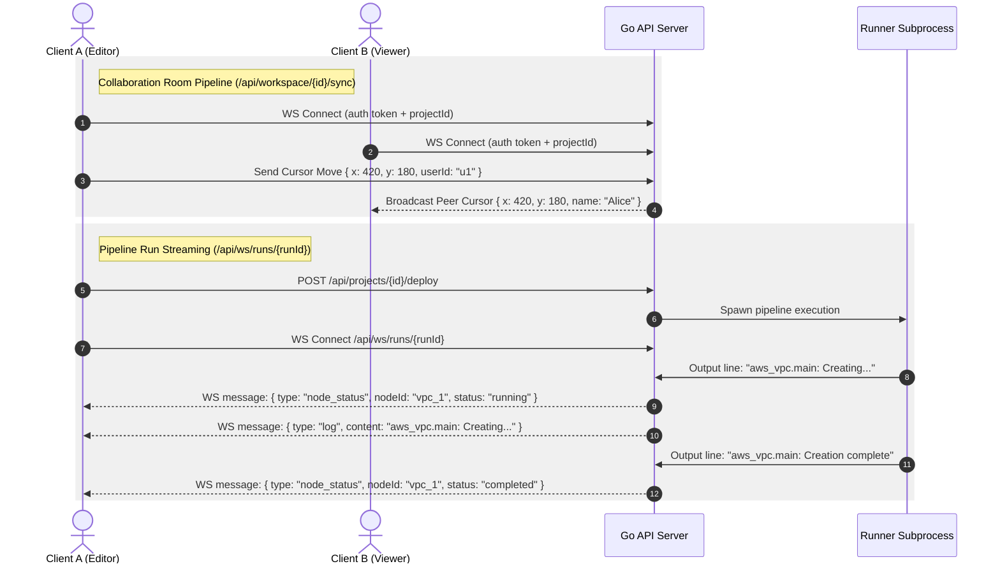

# 01.4 - Realtime Sync & WebSocket Architecture

## Dual WebSocket Channels

InfraCanvas maintains two distinct WebSocket communication pipelines powered by Gorilla WebSockets in the Go API:
1. **Pipeline Run Log & Status Streaming (`/api/ws/runs/{id}`)**: Streams live stdout/stderr execution output and node state transitions during provisioning or destruction.
2. **Workspace Collaboration Room Sync (`/api/workspace/{projectId}/sync`)**: Synchronizes peer cursor coordinates, active user presence, and live canvas graph mutations across team members.



---

## Pipeline Run Streaming Protocol (`/api/ws/runs/{id}`)

### Message Envelope Types
The runner WebSocket server pushes JSON-encoded frames to connected clients:

1. **Log Line Frame**:
```json
{
  "type": "log",
  "content": "TASK [Install Nginx] *********************************************************\n"
}
```

2. **Node Execution Status Transition**:
```json
{
  "type": "node_status",
  "nodeId": "nginx_web_server",
  "status": "running"
}
```

3. **Pipeline Action & Final Status**:
```json
{
  "type": "status",
  "status": "SUCCESS",
  "action": "deploy"
}
```

---

## Late-Joining Client Replay Protection (`RunTracker`)

### The Problem
If a pipeline run starts before the browser completes its WebSocket connection handshake, the client could miss initial log lines and early `node_status` transitions (e.g., VPC creation completing in 1 second).

### The Solution
The backend implements `RunTracker` (`apps/api/main.go`):
```go
type RunTracker struct {
    sync.Mutex
    clients      map[*websocket.Conn]bool
    logs         string
    status       string
    nodeStatuses map[string]string // nodeId -> latest status
}
```

When a new client establishes a WebSocket connection to an ongoing run:
1. The server acquires `tracker.Lock()`.
2. Replays the **entire accumulated log buffer** to the newcomer.
3. Iterates through the `nodeStatuses` map and emits current states for all active canvas nodes.
4. Adds the client connection to the active broadcast subscriber pool.

This prevents UI desynchronization on variable latency network connections or browser page refreshes.

---

## Workspace Collaboration Sync (`/api/workspace/{projectId}/sync`)

The workspace sync pipeline coordinates multi-user interactions:
- **Peer Cursors**: Emits `cursor_move` events containing mouse coordinates, user avatar color, and display name.
- **Node Selection Locks**: Emits `node_locked` / `node_unlocked` when a user selects a block, rendering a colored outline to warn peers against concurrent editing.
- **Presence List**: Emits `peer_joined` / `peer_left` to render active user avatars in the canvas header.

---

## Related Documents
- [[01.2 - System Architecture & Monorepo Structure]]
- [[03.1 - Go Runner Pipeline Engine]]
- [[03.4 - Live Node Status Tracking & Stream Scanning]]
- [[07.1 - Critical Bugs Encountered & Solutions]]
