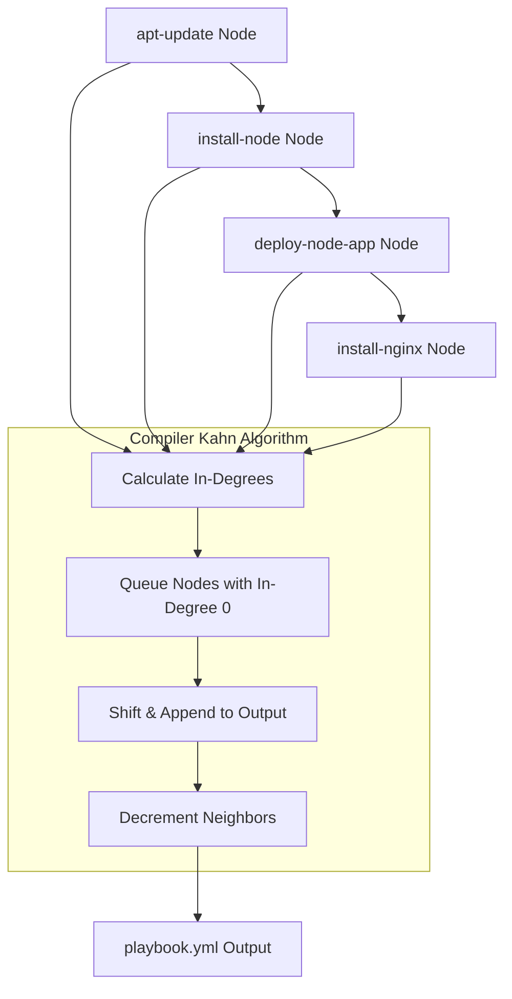

# 02.1 - Topological Ansible Compiler

## Compilation Overview

The Ansible compilation engine resides in `apps/web/app/lib/exportYaml.ts`. It transforms an arbitrary visual node graph into a syntactically valid, executable Ansible playbook (`ansible/playbook.yml`).

The engine interprets canvas connection edges as a Directed Acyclic Graph (DAG) and executes a topological sort (Kahn's Algorithm) so that dependencies execute in strict logical sequence.



---

## Topological Sorting Algorithm (Kahn's Algorithm with Cycle Fallback)

Located in `getSortedNodes(nodes, edges)`:
1. **Adjacency & In-Degree Calculation**:
   - Every node starts with `inDegree = 0`.
   - For every connection edge `(u -> v)`, `adj[u].push(v)` and `inDegree[v]++`.
2. **Initial Queueing**:
   - All nodes with `inDegree === 0` are pushed to `queue` in their original canvas appearance order (ensuring deterministic output).
3. **Queue Processing**:
   - Dequeue node `u`, append to `sortedIds`.
   - Decrement in-degree for all target neighbors `v`. When `inDegree[v] === 0`, enqueue `v`.
4. **Cycle & Disconnected Component Fallback**:
   - If `sortedIds.length < nodes.length` (due to cyclical connections or orphan islands), all remaining unvisited nodes are safely appended in original order to guarantee zero data loss.

---

## Injected Playbook Optimizations & Lock Mitigations

Running Ansible inside Docker sandbox containers or resource-constrained VMs introduces specific execution hazards. The compiler automatically prepends battle-tested tasks:

### 1. `force-unsafe-io` for Container Speed
Docker storage drivers (like overlay2) can suffer severe I/O slowdowns during heavy `dpkg` unpack operations.
```yaml
- name: Configure dpkg unsafe IO
  ansible.builtin.shell: |
    mkdir -p /etc/dpkg/dpkg.cfg.d
    echo "force-unsafe-io" > /etc/dpkg/dpkg.cfg.d/force-unsafe-io
  ignore_errors: yes
```

### 2. Automatic APT/DPKG Lock Buster
When containers reboot or multiple processes invoke package managers, stale lock files crash Ansible.
```yaml
- name: Clean up apt locks
  ansible.builtin.shell: |
    killall -9 apt apt-get dpkg 2>/dev/null || true
    rm -f /var/lib/dpkg/lock-frontend
    rm -f /var/lib/dpkg/lock
    rm -f /var/lib/apt/lists/lock
  ignore_errors: yes
```

### 3. Interrupted DPKG Auto-Recovery
```yaml
- name: Check for interrupted dpkg state
  ansible.builtin.shell: dpkg -l | grep -E '^i[^i]'
  register: dpkg_check
  failed_when: false
  changed_when: false

- name: Fix interrupted dpkg states
  ansible.builtin.shell: dpkg --configure -a
  when: dpkg_check.rc == 0
```

---

## Supported Modular Ansible Task Blocks

The compiler converts visual node configurations into specific Ansible modules:

| Node Identifier | Ansible Modules Used | Description |
| :--- | :--- | :--- |
| `apt-update` | `ansible.builtin.apt` | Updates apt package index with `cache_valid_time: 3600`. |
| `install-nginx` | `ansible.builtin.apt`, `ansible.builtin.service` | Installs Nginx and ensures systemd service is active and enabled on boot. |
| `install-node` | `ansible.builtin.shell`, `ansible.builtin.apt` | Adds NodeSource PPA repo for specified version (e.g., 18.x, 20.x) and installs Node.js. |
| `setup-postgres` | `ansible.builtin.apt`, `ansible.builtin.service` | Installs PostgreSQL, enables service, and configures default database user. |
| `deploy-node-app` | `ansible.builtin.git`, `ansible.builtin.shell` | Clones application repository, runs `npm install`, and spawns/restarts via `pm2`. |
| `firewall-rule` | `community.general.ufw` | Dynamically manages firewall ports (80, 443, 22, custom) with TCP/UDP protocol selection. |
| `copy-env` | `ansible.builtin.copy` | Pushes secret `.env` configuration files to target directory with `0600` permissions. |
| `create-user` | `ansible.builtin.user` | Provisions Linux system users with sudo permissions and home directory. |
| `git-clone` | `ansible.builtin.git` | Clones code repositories from GitHub/GitLab to `/var/www/app`. |
| `custom-script` | `ansible.builtin.shell` | Executes custom raw shell script payloads provided by user custom nodes. |

---

## Related Documents
- [[01.1 - Project Vision & Core Paradigm]]
- [[02.2 - Dynamic Multi-Resource Terraform Generator]]
- [[03.1 - Go Runner Pipeline Engine]]
- [[07.2 - Technical Pitfalls & Edge Cases]]
