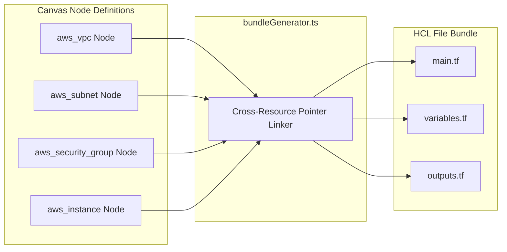

# 02.2 - Dynamic Multi-Resource Terraform Generator

## Generator Architecture

The Terraform generator (`apps/web/app/lib/bundleGenerator.ts`) dynamically transforms visual infrastructure blocks into a fully linked set of HashiCorp HCL files:
- `terraform/main.tf`: Contains provider declarations, resource definitions, and dynamic cross-resource dependency links.
- `terraform/variables.tf`: Maps parameters to typed, defaulted input variables.
- `terraform/outputs.tf`: Declares outputs for provisioned resources (VPC IDs, Subnet IDs, Public IPs, RDS endpoints, S3 bucket names).



---

## Supported AWS Infrastructure Primitives

### 1. `aws_vpc`
- Configurable CIDR block (e.g. `10.0.0.0/16`).
- DNS hostnames and DNS support toggles.
- Environment tagging (`Name`, `Environment`, `ManagedBy = "InfraCanvas"`).

### 2. `aws_subnet`
- Dynamic reference to parent VPC (`vpc_id = aws_vpc.main.id`).
- Availability Zone selection (`us-east-1a`, etc.).
- `map_public_ip_on_launch` configuration.

### 3. `aws_security_group`
- Parametric ingress rules: HTTP (80), HTTPS (443), SSH (22), custom application ports.
- Parametric CIDR allowance blocks.
- Unrestricted egress (`0.0.0.0/0`) boilerplate.

### 4. `aws_instance` (EC2)
- AMI ID resolution (or auto-assigned LocalStack dummy AMI in sandbox mode).
- Instance type configuration (`t2.micro`, `t3.medium`, etc.).
- Root EBS volume sizing (`volume_size`, `volume_type`).
- Dynamic binding to security groups (`vpc_security_group_ids = [aws_security_group.web_sg.id]`).

### 5. `aws_s3_bucket`
- Bucket naming rules.
- Force destroy toggle for easy teardown in sandbox.
- S3 Bucket Versioning (`aws_s3_bucket_versioning`).

### 6. `aws_db_instance` (RDS PostgreSQL / MySQL)
- Engine selection (`postgres`, `mysql`).
- Allocated storage, instance class (`db.t3.micro`).
- Username & password parameter mapping to `variables.tf`.
- `skip_final_snapshot = true` for clean sandbox destruction.

---

## Dynamic Target Provider Switching (LocalStack vs AWS Live)

The generator reads the presence of the AWS Target Node (`aws_target`) on the canvas:

### When Target Environment is `localstack`:
It overrides Terraform endpoints to target the local container on port `4566`:
```hcl
provider "aws" {
  region                      = "us-east-1"
  access_key                  = "test"
  secret_key                  = "test"
  skip_credentials_validation = true
  skip_metadata_api_check     = true
  skip_requesting_account_id  = true
  s3_use_path_style           = true

  endpoints {
    ec2 = "http://localhost:4566"
    s3  = "http://localhost:4566"
  }
}
```

### When Target Environment is `aws_live`:
It generates standard production provider declarations using authenticated credentials from the [[04.3 - AES-256-GCM Credential Vault & Fingerprinting|Credential Vault]].

---

## Related Documents
- [[01.1 - Project Vision & Core Paradigm]]
- [[02.1 - Topological Ansible Compiler]]
- [[03.2 - DevOps Sandbox (LocalStack & SSH Containers)]]
- [[03.3 - Dynamic Inventory & Output State Binding]]
