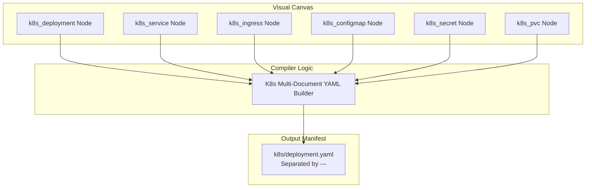

# 02.3 - Kubernetes Manifests Compiler

## Compilation Architecture

The Kubernetes compilation engine (`apps/web/app/lib/bundleGenerator.ts`) translates visual container and orchestration blocks into a unified, multi-document Kubernetes manifest (`k8s/deployment.yaml`).

Each visual block maps to an official Kubernetes API resource with production defaults.

---

## Supported Kubernetes Resource Types

### 1. `k8s_deployment` (Apps/v1)
- Replicas count (e.g. `2`, `3`).
- Container image name and tag (e.g. `nginx:alpine`, `node:18-alpine`).
- Container port mapping.
- Resource limits and requests (`cpu: "250m"`, `memory: "512Mi"`).
- Health probes: Liveness and Readiness HTTP GET probes.

### 2. `k8s_service` (Core/v1)
- Service types: `ClusterIP`, `NodePort`, or `LoadBalancer`.
- Target port and exposed port routing.
- Selector matching against Deployment label tags (`app: <app_name>`).

### 3. `k8s_ingress` (Networking.k8s.io/v1)
- Hostname rules (e.g. `api.example.com`).
- Path routing rules (e.g. `/` -> `service:80`).
- Ingress class annotations (e.g. `ingressClassName: nginx`).

### 4. `k8s_configmap` & `k8s_secret` (Core/v1)
- Key-value application environment variables.
- **Automated Base64 Encoding**: For `k8s_secret`, the compiler automatically base64-encodes plaintext inputs on-the-fly to satisfy Kubernetes API specification.

### 5. `k8s_pvc` (PersistentVolumeClaim Core/v1)
- Storage access modes (`ReadWriteOnce`, `ReadOnlyMany`).
- Storage size requests (e.g. `10Gi`).
- Storage class names (`standard`, `gp2`, `fast-ssd`).

---

## Related Documents
- [[01.1 - Project Vision & Core Paradigm]]
- [[02.2 - Dynamic Multi-Resource Terraform Generator]]
- [[02.5 - ZIP Bundle Packaging & Export]]
