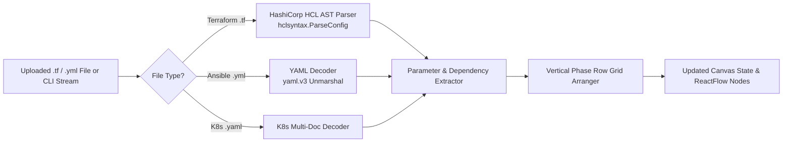

# 02.4 - HCL and YAML Reverse Importer AST

## Reverse-Engineering Code to Canvas

While forward generation compiles visual nodes into code, the **Importer Engine** (`apps/api/importer/`) performs the inverse: reading existing `.tf`, `.yml`, and `.yaml` files and reverse-synthesizing an interactive visual graph.

---

## Backend AST Parsers Breakdown

### 1. Terraform HCL Parser (`apps/api/importer/terraform.go` and `compiler.go`)
- Leverages official `github.com/hashicorp/hcl/v2/hclsyntax`.
- Scans `Block` definitions matching `resource "aws_vpc" "name"` or `resource "aws_instance" "name"`.
- Extracts attributes (e.g. `cidr_block`, `instance_type`, `ami`, `tags`).
- Parses variable expressions (`var.vpc_cidr`, `aws_security_group.sg.id`) to construct connection edges automatically.

### 2. Ansible Playbook Parser (`apps/api/importer/ansible.go`)
- Leverages `gopkg.in/yaml.v3`.
- Unmarshals playbook tasks into structured task objects.
- Recognizes task names (e.g., `apt`, `service`, `ufw`, `git`, `copy`) and maps them to catalog nodes (`apt-update`, `install-nginx`, `setup-postgres`).
- Chained tasks are converted into sequentially connected ReactFlow canvas nodes.

### 3. Kubernetes YAML Parser (`apps/api/importer/k8s.go`)
- Splits multi-document YAML on `---`.
- Parses `kind: Deployment`, `kind: Service`, `kind: Ingress`, `kind: ConfigMap`, `kind: Secret`.
- Converts container specifications, ports, replicas, and metadata into visual parameters.

---

## Vertical Phase Rows Grid Layout (`apps/api/importer/importer.go`)

When importing code into an existing or empty canvas, nodes are automatically positioned using the **Vertical Phase Rows** algorithm:
- **Row 1 (Y: 50 + offset)**: Infrastructure Layer (Terraform nodes arranged horizontally, X spaced by 280px).
- **Row 2 (Y: 300 + offset)**: Configuration Layer (Ansible nodes arranged horizontally, X spaced by 280px).
- **Row 3 (Y: 550 + offset)**: Container Layer (Kubernetes nodes arranged horizontally, X spaced by 280px).

If existing nodes are present on the canvas, the importer finds `maxY` across all existing nodes and sets the new offset to `maxY + 300`, preventing imported nodes from overlapping existing work.

---

## Related Documents
- [[02.1 - Topological Ansible Compiler]]
- [[02.2 - Dynamic Multi-Resource Terraform Generator]]
- [[05.4 - Custom Node Authoring & Validation]]
- [[06.1 - InfraCanvas CLI & Reverse Import Tool]]
