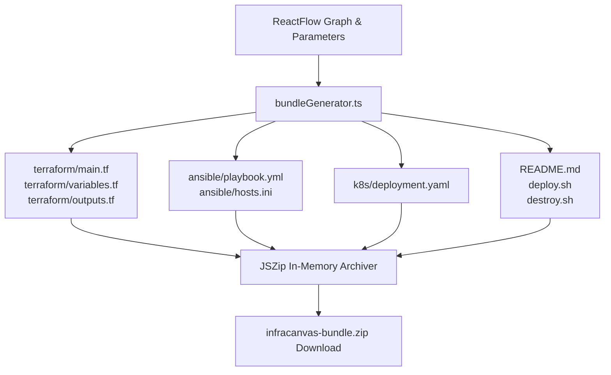

# 02.5 - ZIP Bundle Packaging & Export

## Client-Side Package Compilation

InfraCanvas allows users to export their entire visual workspace as a standalone, production-ready DevOps repository bundle.

The export pipeline (`apps/web/app/lib/bundleGenerator.ts` using `jszip`) packages all generated files directly in the browser memory without backend requests, enabling instant downloads.



---

## Exported Bundle Directory Layout

```text
infracanvas-bundle/
├── README.md                # Markdown quickstart with provisioning instructions
├── deploy.sh                # Shell script to apply Terraform & run Ansible
├── destroy.sh               # Teardown script for clean resource cleanup
├── terraform/
│   ├── main.tf              # Provisioning resources
│   ├── variables.tf         # Parameter declarations
│   └── outputs.tf           # Exported IPs, VPC IDs, endpoints
├── ansible/
│   ├── playbook.yml         # Topologically sorted tasks
│   └── hosts.ini            # Inventory definition
└── k8s/
    └── deployment.yaml      # Multi-resource Kubernetes manifests
```

---

## Related Documents
- [[02.1 - Topological Ansible Compiler]]
- [[02.2 - Dynamic Multi-Resource Terraform Generator]]
- [[02.3 - Kubernetes Manifests Compiler]]
