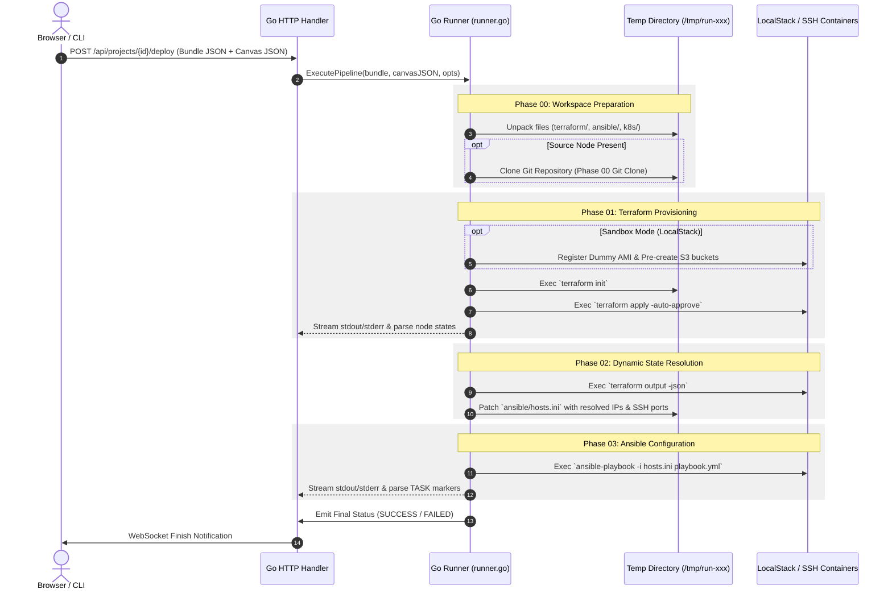

# 03.1 - Go Runner Pipeline Engine

## Runner Engine Architecture

The core pipeline execution engine resides in `apps/api/runner/runner.go`. It orchestrates DevOps tools (Git, Terraform, Ansible, Kubectl) against target infrastructure.



---

## The 4-Phase Execution Lifecycle

### Phase 00: Source Ingestion & Workspace Setup
- Generates a transient execution directory (`/tmp/infracanvas-run-<uuid>` or `./data/runs/<uuid>`).
- Flushes the payload `FileItem` array into directory structure.
- If a Code Repository Node (`tech: "Source"`) is found in the canvas JSON, the runner executes `git clone -b <branch> <repoUrl>` into the local staging folder before infrastructure provisioning starts.

### Phase 01: Cloud & Infrastructure Provisioning (Terraform)
- Inspects target configuration. If targeting LocalStack, executes pre-flight checks:
  - Registers a mock AMI via EC2 RegisterImage API (resolving the missing AMI issue in LocalStack 3.x).
  - Pre-creates S3 backend state buckets if required.
- Spawns `terraform init` and `terraform apply -auto-approve`.
- Scans output line-by-line in real time, emitting WebSocket events.

### Phase 02: Dynamic Inventory & Output State Binding
- Resolves provisioned infrastructure outputs via `terraform output -json`.
- Maps EC2 public/private IPs or LocalStack mock IPs to the Ansible inventory (`ansible/hosts.ini`).
- In sandbox mode, redirects host connections to the local Docker container SSH ports (`2222`, `2223`) using the bundled `sandbox/id_rsa` private key.

### Phase 03: OS Configuration & App Deployment (Ansible)
- Spawns `ansible-playbook -i hosts.ini playbook.yml --ssh-common-args="-o StrictHostKeyChecking=no"`.
- Intercepts `TASK [...]` lines to advance individual canvas node status strips one-by-one.

---

## Security & Log Redaction (`SecretRedactor`)
Cloud credentials and private keys injected into environment variables or Terraform parameters must not appear in plain text inside execution logs or database tables.

The `SecretRedactor` struct tracks active secrets and performs substring masking:
```go
type SecretRedactor struct {
    secrets []string
}

func (r *SecretRedactor) Redact(line string) string {
    for _, s := range r.secrets {
        if len(s) > 3 {
            line = strings.ReplaceAll(line, s, "********")
        }
    }
    return line
}
```

---

## Related Documents
- [[01.4 - Realtime Sync & WebSocket Architecture]]
- [[03.2 - DevOps Sandbox (LocalStack & SSH Containers)]]
- [[03.3 - Dynamic Inventory & Output State Binding]]
- [[03.4 - Live Node Status Tracking & Stream Scanning]]
- [[04.3 - AES-256-GCM Credential Vault & Fingerprinting]]
