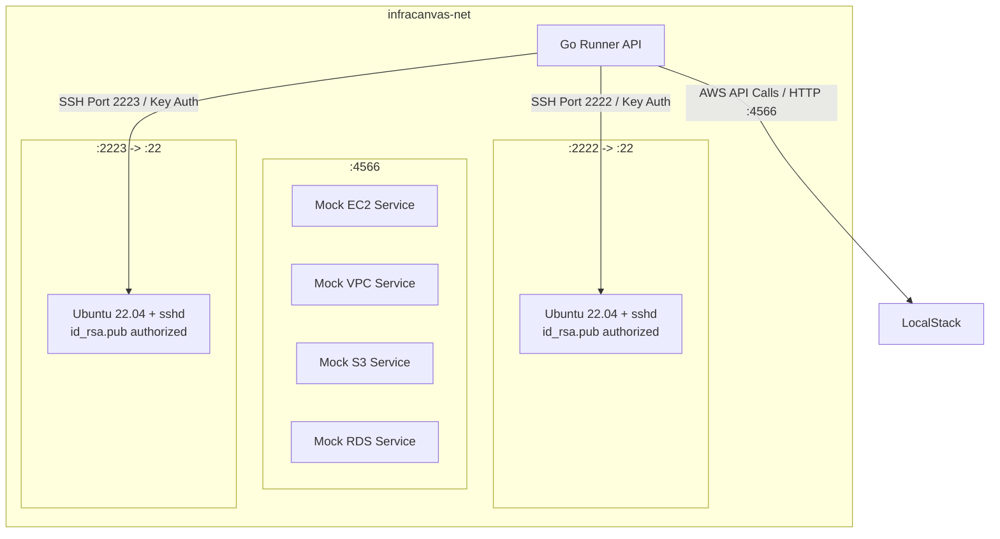

# 03.2 - DevOps Sandbox (LocalStack & SSH Containers)

## Purpose of the Sandbox

Deploying infrastructure to real AWS, GCP, or Azure accounts incurs financial costs, requires credentials, and risks orphaned cloud resources during development.

The **InfraCanvas DevOps Sandbox**, as originally shipped (root `docker-compose.yml`), provides a zero-cost, hermetic local cloud environment running entirely inside Docker — this remains the default experience for the vast majority of users, unaffected by the Phase 1 opt-in beta below.

> [!IMPORTANT]
> As of [[08.4 - Local Sandbox Agent Rollout & Migration Plan]]'s Phase 1, there are now **three** Compose files, each with a different service boundary — do not assume "the sandbox compose file" means the same thing across docs:
> - **`docker-compose.yml`** (root) — the diagram and services below. `api` + `localstack` + `ubuntu_ssh_1`/`ubuntu_ssh_2`, all one Compose project, one Docker network. Still the default; nothing here changed.
> - **`sandbox/docker-compose.sandbox.yml`** — Phase 1's "local machine" half, driven by `infracanvas sandbox up`. Only `ubuntu_ssh_1`/`ubuntu_ssh_2` — **LocalStack was deliberately removed from this file**. It doesn't belong on the "local machine" side of the Agent/tunnel split: LocalStack is a cloud-API mock the Runner calls directly over the network, exactly like it would call real AWS, with no relationship to the Ansible/SSH bridging the Agent handles. Leaving it here also collided on host port 4566 with the file below when both stacks run together, which is the normal case for testing `local_agent`.
> - **`docker-compose.hosted.yml`** (new, repo root) — Phase 1's "hosted backend" half for local testing of the split model: `api` + `agent-gateway` + `localstack`. Explicit `name: infracanvas-hosted` in the file, and `sandbox up`/`down` pass `-p infracanvas-sandbox` explicitly too — both compose files originally had no explicit project name, which meant Compose derived one from the containing directory and treated the `api` service in both `docker-compose.yml` and `docker-compose.hosted.yml` as *the same logical service*, silently replacing whichever was already running. Real incident during Phase 1 testing; fixed by making every project name explicit.



---

## Docker Services Configuration

### 1. `localstack` (Port 4566)
Simulates AWS core endpoints:
- `SERVICES=s3,ec2,rds`
- `AWS_DEFAULT_REGION=us-east-1`
- `DOCKER_HOST=unix:///var/run/docker.sock`

### 2. `ubuntu_ssh_1` & `ubuntu_ssh_2` (Ports 2222, 2223)
Simulated target Linux servers:
- Built from `sandbox/Dockerfile.ssh`.
- Base: `ubuntu:22.04` with `openssh-server`, `python3`, `sudo`, `curl`.
- Key pair: Pre-configured `sandbox/id_rsa.pub` placed into `/root/.ssh/authorized_keys` with `chmod 600`.
- Root login permitted with SSH passwordless key authentication.

---

## LocalStack 3.x AMI Behavior & Pre-Flight Fixes

### Missing AMI Registration
In LocalStack 3.x, no AMIs exist by default. Running `terraform apply` on an `aws_instance` with `ami = "ami-0c55b159cbfafe1f0"` fails with:
`Error: couldn't find resource`.

**The Solution (`registerLocalStackAMI` in `runner.go`)**:
Before running Terraform, the runner issues an HTTP POST request to LocalStack's EC2 endpoint:
```http
POST http://localstack:4566/
Content-Type: application/x-www-form-urlencoded

Action=RegisterImage&Name=infracanvas-ami&RootDeviceName=%2Fdev%2Fsda1&Version=2016-11-15
```
It extracts the generated AMI ID (e.g. `ami-12345678`) via regex and injects it into `variables.tf`.

---

## Related Documents
- [[01.2 - System Architecture & Monorepo Structure]]
- [[03.1 - Go Runner Pipeline Engine]]
- [[03.3 - Dynamic Inventory & Output State Binding]]
- [[03.6 - Remote Sandbox Agent & Bridging Connection Protocol]]
- [[07.1 - Critical Bugs Encountered & Solutions]]
- [[08.4 - Local Sandbox Agent Rollout & Migration Plan]]
