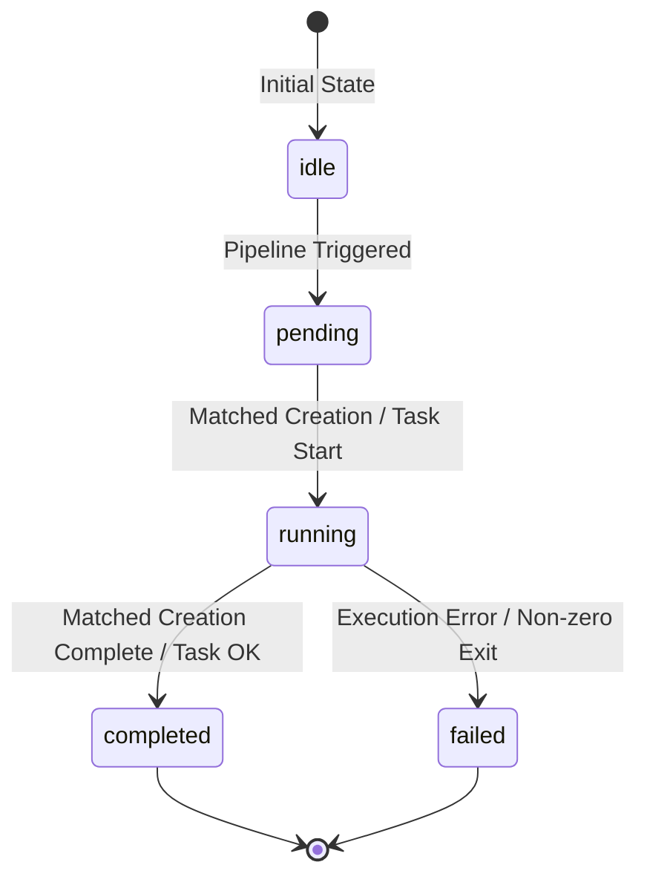

# 03.4 - Live Node Status Tracking & Stream Scanning

## Fine-Grained Node Progress

Rather than showing a generic progress bar or advancing all nodes simultaneously, InfraCanvas provides **per-node real-time execution tracking**.

As Terraform and Ansible execute in the runner, the Go backend scans stdout output using regular expressions, correlates output markers to specific ReactFlow node IDs, and pushes instant `node_status` WebSocket messages to the client.

---

## Log Stream Matching Rules (`runner/runner.go`)

### 1. Terraform Resource State Transitions
- **`pending` -> `running`**:
  Matches pattern: `(?P<res>[a-zA-Z0-9_-]+): Creating...` or `(?P<res>[a-zA-Z0-9_-]+): Modifying...`
  *Action:* Identifies corresponding canvas node (e.g., `aws_vpc` or `aws_instance`) and emits `status = "running"`.
- **`running` -> `completed`**:
  Matches pattern: `(?P<res>[a-zA-Z0-9_-]+): Creation complete`
  *Action:* Emits `status = "completed"`.
- **Destroy transitions**:
  Matches pattern: `(?P<res>[a-zA-Z0-9_-]+): Destroying...` -> `Destruction complete`.

### 2. Ansible Task State Transitions
- Matches pattern: `TASK \[(?P<taskname>.*?)\]`
- *Action:* The runner maintains a queue of Ansible canvas nodes in topological execution order. Each `TASK [...]` line shifts the preceding node to `completed` and transitions the next node in sequence to `running`.

### 3. Source & Target Nodes
- **Source Node (`tech: "Source"`)**: Transitions to `running` when `git clone` begins, and `completed` when clone completes.
- **Target Node (`tech: "Target"`)**: Marked `completed` at pipeline start as it acts as an environment configuration descriptor without execution overhead.

---

## Visual Status Strip Indicators (`ReactFlowCanvasNode.tsx`)

Each node card renders a status strip along its bottom border:
- **`pending`**: Solid gray indicator.
- **`running` (Deploy Action)**: Pulsing Blue glow animation (`animate-pulse`).
- **`running` (Destroy Action)**: Pulsing Red glow animation.
- **`completed`**: Solid green (`bg-emerald-500`) with checkmark icon.
- **`failed`**: Solid red (`bg-rose-500`) with error icon.

---

## Related Documents
- [[01.4 - Realtime Sync & WebSocket Architecture]]
- [[03.1 - Go Runner Pipeline Engine]]
- [[05.1 - ReactFlow Canvas & Interaction Modes]]
