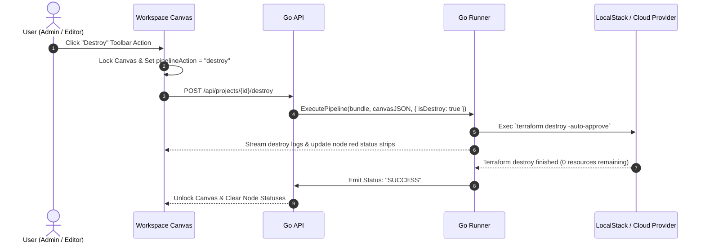

# 03.5 - Teardown & Destroy Lifecycle

## Resource Teardown Protocol

Provisioned infrastructure must support clean teardown to prevent stranded cloud costs and container state drift.

InfraCanvas implements a dedicated **Destroy Pipeline** triggered via `POST /api/projects/{id}/destroy`.

---

## Post-Deploy Auto-Destroy (`CLEANUP` State)

When testing pipelines in transient CI or sandbox validation environments, the runner supports an automated post-deployment clean-up mode.

1. The pipeline runs `deploy` and validates all steps.
2. An `onStatusChange` callback emits a `CLEANUP` status.
3. The terminal drawer displays a dedicated "CLEANING UP" badge.
4. The runner executes `terraform destroy`, resets container state, and finalizes with `SUCCESS`.

---

## Related Documents
- [[03.1 - Go Runner Pipeline Engine]]
- [[03.4 - Live Node Status Tracking & Stream Scanning]]
- [[05.3 - Execution Safety Locking & Readonly Modes]]
