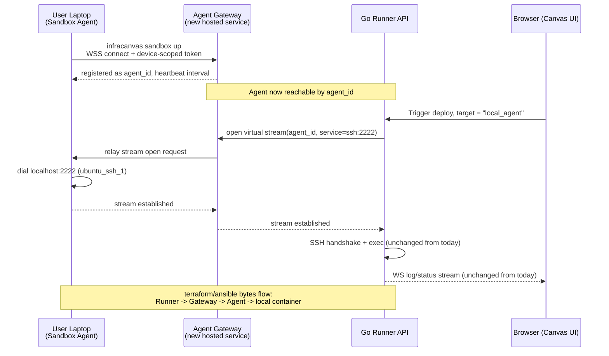

# 03.6 - Remote Sandbox Agent & Bridging Connection Protocol

## Problem Statement

The existing DevOps Sandbox (see [[03.2 - DevOps Sandbox (LocalStack & SSH Containers)]]) runs `localstack`, `ubuntu_ssh_1`, and `ubuntu_ssh_2` next to the Go Runner API inside the same Docker network, so the runner reaches them by container name over a private bridge network. Once the sandbox moves to a developer's laptop, that assumption breaks: the laptop almost always sits behind NAT and/or a firewall with no public IP or forwarded port, so the hosted Runner API cannot open an inbound connection to `ubuntu_ssh_1:2222` on the user's machine the way it does today.

## Chosen Pattern: Agent-Initiated Outbound Tunnel

The connection must be initiated by the user's machine, not the server. This is the same pattern used by GitHub Actions self-hosted runners, Buildkite agents, and tools like `ngrok`/`chisel`/`frp`: a lightweight agent process on the user's machine opens a persistent **outbound** connection to a hosted relay, and all traffic in both directions is multiplexed over that one connection.

The key architectural point: the **Runner still terminates SSH and still does the log-pattern scanning it does today** (see [[03.4 - Live Node Status Tracking & Stream Scanning]]). Only the transport underneath the SSH connection changes — a TCP socket becomes a multiplexed tunnel stream.

**Correction from Phase 1 implementation** (this section originally assumed `runner.go` holds an in-process SSH client that could be "re-pointed at a `net.Conn`" — it does not; SSH happens by shelling `ansible-playbook` out as a subprocess against a generated `hosts.ini`, with zero `ssh.Dial`/`net.Dial` calls anywhere in `apps/api`). The transport swap is instead done via an SSH **ProxyCommand**: `runner.go`'s `local_agent` branch passes `-o ProxyCommand="infracanvas sandbox proxy ..."` in `--ssh-common-args`, and OpenSSH itself spawns that CLI subcommand as a child process, feeding it the tunnel connection over its own stdin/stdout — the same pattern Teleport and AWS SSM use. This achieves the same end result (Ansible's SSH session runs through the Gateway tunnel) without needing any in-process SSH client in `apps/api` at all. See [[08.4 - Local Sandbox Agent Rollout & Migration Plan]]'s Phase 1 for the full implementation.

## Transport Implementation Notes

Do not hand-roll framing/multiplexing over the WebSocket. Use an established stream-multiplexing library so many logical connections (SSH to container 1, SSH to container 2, HTTP to LocalStack's API on 4566) can share one physical connection with proper backpressure and clean stream teardown — `hashicorp/yamux` (already proven at this scale inside Consul and Nomad) is the natural fit for a Go backend, and has a WASM/JS-friendty analog if a browser-side agent variant is ever wanted. The Gateway's job becomes deliberately dumb: authenticate the agent, map `agent_id` to a live yamux session, and open/close logical streams on demand. It should not parse or understand SSH, Terraform, or Ansible traffic — that stays the Runner's job, unchanged.

## Security Scoping (This Is the Part That Must Not Be an Afterthought)

1. **Destination allowlisting, not a general proxy.** The Gateway/Agent must only accept stream requests for a small, fixed set of logical services the Agent itself defines when it registers (`ssh:2222`, `ssh:2223`, `localstack:4566`) — never an arbitrary host:port passed by the Runner. Without this, the tunnel is a generic outbound proxy that a compromised or malicious Runner-side actor could use to reach arbitrary internet hosts *from the user's network*, which is a real SSRF-adjacent liability, not a hypothetical one.
2. **Per-installation credentials, not a shared secret.** Each Agent authenticates with a token scoped to one user/project, issued via the device-authorization flow described in [[06.3 - Sandbox Agent CLI Commands (infracanvas sandbox)]], not a static API key. The Gateway must reject any Runner request to route to an `agent_id` that does not belong to the same account/project as the authenticated deploy request — otherwise one tenant's Runner traffic could be misrouted to another tenant's laptop.
3. **Least-privilege Docker access.** The Agent needs to manage only its own sandbox containers. Prefer a Docker context scoped to a project-labelled namespace over blanket root socket access; document rootless Docker / Docker Desktop equivalents where available. This matters because the Agent is exactly the kind of binary a security-conscious developer will refuse to run with unscoped Docker access — see the open-source recommendation in [[09.2 - Repository & License Split Strategy (Open-Core vs Source-Available)]], which exists partly to let people verify this claim themselves.
4. **Per-machine SSH keys, not the committed repo key.** The current sandbox uses a single SSH keypair (`sandbox/id_rsa` / `id_rsa.pub`) that is checked into the repository — acceptable for a throwaway, ephemeral, same-host dev container, but the wrong pattern once a real network tunnel exists between a user's machine and InfraCanvas's infrastructure. `infracanvas sandbox up` should generate a fresh keypair per installation and bake the public half into the locally built SSH target container at build time, never reusing a shared key that lives in git history. This should be fixed independent of the bridging work, since a key committed to a public or even private repo's history is compromised by definition the moment it's pushed.
5. **Heartbeats and idle timeouts.** Laptops sleep, WiFi drops, VPNs reconnect with a new IP. The Gateway must detect a dead Agent connection quickly (short heartbeat interval, e.g. 15-30s) and surface that as an explicit `disconnected` state through the existing node-status WebSocket channel described in [[03.4 - Live Node Status Tracking & Stream Scanning]], rather than letting a deploy hang against a half-open stream. This is also the honest answer to "will this feel real-time with no latency" raised earlier — it will feel real-time when connected, but the UI must clearly show when it is not connected, since that state is now a normal and frequent occurrence rather than an edge case.
6. **Rate limiting at the account level.** Even though the Agent model shifts sandbox *compute* cost off InfraCanvas's infrastructure, the Gateway's relay bandwidth and the control-plane API are still InfraCanvas-hosted and billable. Cap concurrent streams and bytes/sec per account regardless of tier, both to bound cost and to close off the abuse vector in point 1 even if the allowlist has a bug.

## New Runner Target Type

The Runner already distinguishes deployment targets (`live` cloud vs. in-container `localstack` sandbox, per [[04.3 - AES-256-GCM Credential Vault & Fingerprinting]]'s `isDocker` fallback logic). This work adds a third: `local_agent`. When a pipeline targets `local_agent`, the Runner resolves SSH/LocalStack connections through the Gateway-backed `net.Conn` described above instead of dialing a container name directly, and the Vault's sandbox-key-fallback behavior extends to also apply here — using the per-installation key negotiated at `sandbox up` time rather than the legacy shared key.

## Related Documents
- [[03.2 - DevOps Sandbox (LocalStack & SSH Containers)]]
- [[03.1 - Go Runner Pipeline Engine]]
- [[03.4 - Live Node Status Tracking & Stream Scanning]]
- [[06.3 - Sandbox Agent CLI Commands (infracanvas sandbox)]]
- [[09.2 - Repository & License Split Strategy (Open-Core vs Source-Available)]]
- [[04.3 - AES-256-GCM Credential Vault & Fingerprinting]]
