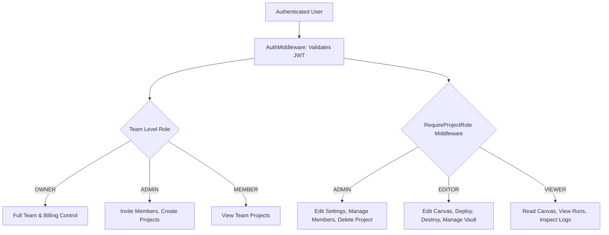

# 04.1 - Authentication & RBAC Access Control

## Authentication Architecture

InfraCanvas implements a stateless **JWT-based authentication scheme** combined with bcrypt password hashing and OAuth 2.0 identity federation.

### User Plans & Billing Tiers
Users possess a plan level stored in the `users.plan` column:
- `FREE`: Access to standard catalog blocks, local sandbox deployments, 1 team.
- `PRO`: Unlocks custom node creation (HCL/YAML authoring), unlimited projects, cloud credential storage.
- `ENTERPRISE`: Unlocks organization discovery, multi-cloud targets, team join request queues, unlimited seats.

---

## Role-Based Access Control (RBAC) Matrix

InfraCanvas enforces access control at two distinct hierarchy levels: **Team Level** and **Project Level**.

### Project Role Permissions Matrix

| Capability / API Endpoint | Minimum Project Role Required |
| :--- | :---: |
| View Project Canvas & History (`GET /api/projects/{id}/canvas`) | **`VIEWER`** |
| View Pipeline Runs & Logs (`GET /api/projects/{id}/runs`) | **`VIEWER`** |
| View Masked Cloud Credentials (`GET /api/projects/{id}/credentials`) | **`VIEWER`** |
| Update Canvas State / Auto-Save (`PUT /api/projects/{id}/canvas`) | **`EDITOR`** |
| Trigger Deploy Pipeline (`POST /api/projects/{id}/deploy`) | **`EDITOR`** |
| Trigger Destroy Teardown (`POST /api/projects/{id}/destroy`) | **`EDITOR`** |
| Import Code (`POST /api/projects/{id}/import`) | **`EDITOR`** |
| Create / Delete Credentials (`POST/DELETE /api/projects/{id}/credentials`) | **`EDITOR`** |
| Create / Delete Custom Nodes (`POST/DELETE /api/projects/{id}/custom-nodes`) | **`EDITOR`** |
| Edit Project Metadata & Visibility (`PATCH /api/projects/{id}`) | **`ADMIN`** |
| Add / Remove Collaborators (`POST/DELETE /api/projects/{id}/members`) | **`ADMIN`** |
| Approve / Reject Join Requests (`POST /api/projects/{id}/join-requests/{id}/*`) | **`ADMIN`** |
| Delete Project ("Danger Zone") (`DELETE /api/projects/{id}`) | **`ADMIN`** |

---

## Go Middleware Implementation (`apps/api/auth.go`)

### 1. `AuthMiddleware`
Extracts `Bearer <token>` from the `Authorization` header, validates HMAC-SHA256 signature, extracts `userId` and `userEmail`, and injects a `UserContext` into the request context.

### 2. `RequireProjectRole(requiredRole string)`
Queries `project_members` and `projects` tables. Verifies:
1. Is the user the project creator or team owner? (Automatic Admin).
2. If not, does the user have `ADMIN >= EDITOR >= VIEWER` privilege matching `requiredRole`?
3. Returns `403 Forbidden` if insufficient permissions.

---

## Related Documents
- [[01.3 - Data Models & SQLite Schema]]
- [[04.2 - Social OAuth 2.0 Flow (Google & GitHub)]]
- [[04.3 - AES-256-GCM Credential Vault & Fingerprinting]]
