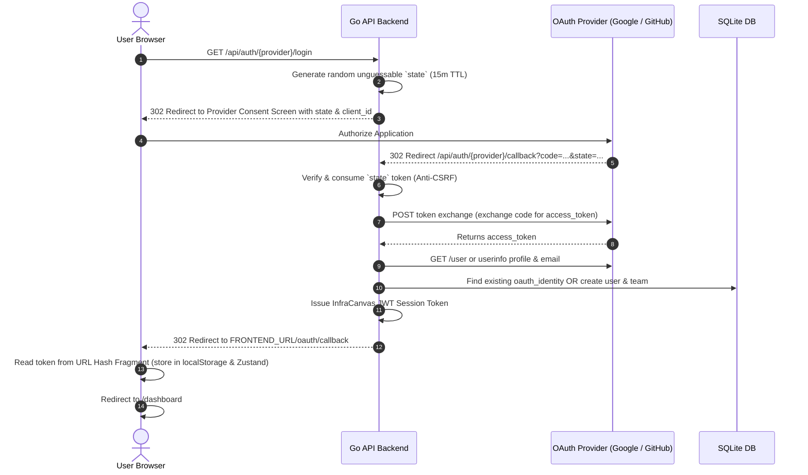

# 04.2 - Social OAuth 2.0 Flow (Google & GitHub)

## OAuth 2.0 Authorization-Code Flow

InfraCanvas implements standard OAuth 2.0 authorization-code authentication with Google and GitHub (`apps/api/oauth.go`), supporting "Continue with Google" and "Continue with GitHub" logins.

---

## Security Decisions & Architectural Notes

### 1. Dedicated `oauth_identities` Table (Decoupled Identity Pattern)
Identities are stored in a dedicated `oauth_identities` table rather than altering the `users` table:
- Supports linking multiple OAuth providers to a single user account.
- Adding future providers (SAML, Apple, Microsoft) requires zero database schema migrations on the core `users` table.

### 2. Auto-Linking vs Account Takeover Risk
If an existing user registered with password at `alice@example.com`, and later logs in via OAuth:
- **Rule**: Auto-link ONLY if the OAuth provider explicitly confirms `email_verified == true`.
- Google provides `email_verified: true`.
- GitHub's `/user` endpoint does not guarantee verification, so a mandatory secondary API call is made to `GET /user/emails` to find the verified primary email (`fetchGithubPrimaryEmail`).
- If an email is unverified by the provider, auto-linking is rejected to prevent account takeover vulnerabilities.

### 3. CSRF Protection via Single-Use State Tokens
Before redirecting to Google or GitHub, the backend generates a cryptographically secure random token stored in an in-memory thread-safe map with a 15-minute TTL.
Callbacks with missing, expired, or mismatched state tokens are rejected with `400 Bad Request`.

### 4. URL Hash Fragment Token Hand-off (`#token=...`)
When redirecting back to the Next.js frontend, the backend passes the JWT token inside the **URL Fragment (`#token=...`)**, never in query parameters (`?token=...`):
- Hash fragments are client-side only and never transmitted in HTTP request headers.
- Hash fragments are not logged in proxy access logs or browser history.
- The Next.js client reads `window.location.hash`, writes the token to `useAuthStore`, and removes the hash with `window.history.replaceState()`.

---

## Related Documents
- [[01.3 - Data Models & SQLite Schema]]
- [[04.1 - Authentication & RBAC Access Control]]
- [[07.1 - Critical Bugs Encountered & Solutions]]
