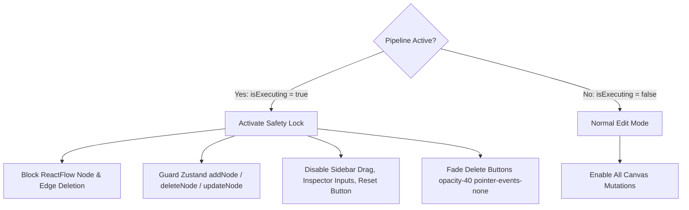

# 05.3 - Execution Safety Locking & Readonly Modes

## Canvas Execution Safety Lock

Modifying, moving, or deleting nodes while a deployment or teardown pipeline is running against infrastructure creates race conditions (such as deleting a security group while Terraform is in the process of binding it to an EC2 instance).

InfraCanvas implements an **Execution Safety Locking** mechanism whenever a pipeline is in the `RUNNING` or `DESTROYING` state (`isExecuting === true`).

---

## Guarded Mutation Interceptors

### 1. ReactFlow Change Interception (`onNodesChange`, `onEdgesChange`)
Filters out all change events of type `remove` or `add` while `isExecuting` is true, ignoring delete keystrokes.

### 2. Zustand Store Mutation Guards
Store actions such as `addNode`, `deleteNode`, and `updateNodeParameters` check the `isExecuting` flag and return early with a warning notification if invoked during execution.

### 3. Visual UI Lock State
- The **Sidebar** blocks disable drag handles.
- The **NodeConfigPanel** inputs switch to a disabled state with lock indicators.
- Delete buttons on nodes are dimmed with `opacity-40 cursor-not-allowed`.
- The bottom toolbar renders an active execution indicator.

---

## Related Documents
- [[03.1 - Go Runner Pipeline Engine]]
- [[05.1 - ReactFlow Canvas & Interaction Modes]]
- [[05.2 - Zustand State Stores Architecture]]
- [[07.1 - Critical Bugs Encountered & Solutions]]
