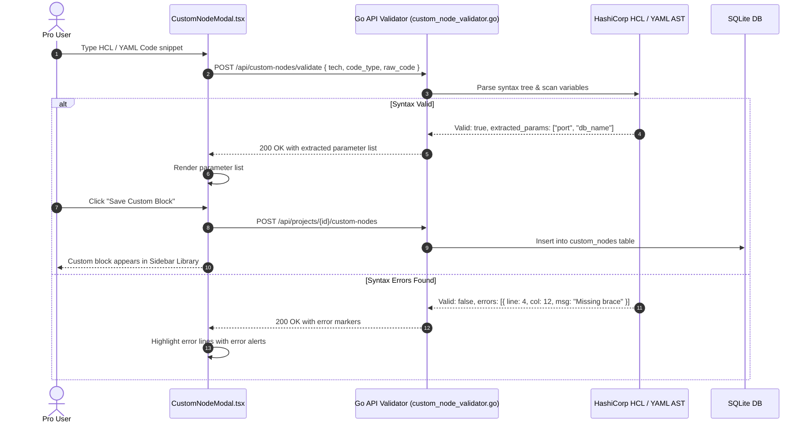

# 05.4 - Custom Node Authoring & Validation

## User-Authored Infrastructure Blocks

InfraCanvas enables Pro and Enterprise tier users to author custom reusable canvas blocks using **Custom Node Authoring** (`apps/web/app/components/CustomNodeModal.tsx`).

Users provide custom Terraform HCL or Ansible/K8s YAML snippets. The system validates the syntax in real time, extracts configurable variables, and registers the block in the project library catalog.

---

## Server-Side AST Syntax Validation (`custom_node_validator.go`)

### 1. Terraform HCL AST Parser
- Uses `hclsyntax.ParseConfig([]byte(code), "custom.tf", hcl.Pos{Line: 1, Column: 1})`.
- If diagnostics contain errors, extracts line numbers, column numbers, and error summaries.
- Traverses AST blocks to extract variable expressions matching `var.<variable_name>`.

### 2. YAML Parser (Ansible & Kubernetes)
- Uses `yaml.Unmarshal` with detailed node error tracking.
- Scans Jinja2 variable interpolations matching `{{\s*([a-zA-Z0-9_]+)\s*}}`.

---

## Related Documents
- [[02.4 - HCL and YAML Reverse Importer AST]]
- [[04.1 - Authentication & RBAC Access Control]]
- [[05.1 - ReactFlow Canvas & Interaction Modes]]
