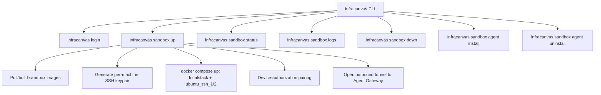

# 06.3 - Sandbox Agent CLI Commands (`infracanvas sandbox`)

## Scope

Extends the existing `infracanvas` CLI (see [[06.1 - InfraCanvas CLI & Reverse Import Tool]]) with a `sandbox` command group that lets a developer stand up the local DevOps Sandbox described in [[03.2 - DevOps Sandbox (LocalStack & SSH Containers)]] and bridge it to the hosted Runner via the tunnel protocol in [[03.6 - Remote Sandbox Agent & Bridging Connection Protocol]] — without cloning the repository.

## Command Reference

### `infracanvas sandbox up`
1. Checks for a local Docker daemon (Docker Desktop, Colima, Podman-compatible socket, etc.); prints a clear remediation message if none is found rather than a raw connection error.
2. Generates a fresh per-machine SSH keypair under `~/.infracanvas/sandbox/` if one does not already exist for this installation — never reuses a shared or repo-committed key (see the key-management note in [[03.6 - Remote Sandbox Agent & Bridging Connection Protocol]]).
3. Pulls the published `infracanvas/sandbox-localstack` and `infracanvas/sandbox-ssh-target` images (or builds them locally from the open `sandbox/` configs — see [[09.2 - Repository & License Split Strategy (Open-Core vs Source-Available)]] for why those configs are permissively licensed) and brings them up via an embedded Compose definition, injecting the freshly generated public key as a build/mount argument instead of a baked-in default. As of [[08.4 - Local Sandbox Agent Rollout & Migration Plan]]'s Phase 2 ("Zero-clone `sandbox up`"), the compose file and Dockerfile are genuinely embedded in the `infracanvas` binary (`//go:embed`, not a repo-relative read) and extracted to `~/.infracanvas/sandbox/compose/` at run time — this is what makes "without cloning the repository" above literally true rather than aspirational.
4. Runs the pairing flow described below if no valid agent token is cached.
5. Starts the Agent process, which opens the outbound tunnel and registers with the Gateway.
6. Prints a status summary: container health, exposed local ports, and tunnel connection state.

### `infracanvas sandbox status`
Shows container health (`docker ps`-equivalent, scoped to the sandbox's project label) and the Agent's tunnel connection state — `PENDING` (pairing not yet approved), `ACTIVE`, or `DISCONNECTED` — plus the timestamp of the last successful heartbeat to the Gateway. This is the primary diagnostic surface for "why isn't my deploy reaching my sandbox" support questions, and should be the first thing documented in the `/docs` setup guide.

**Simplified from an earlier `connected`/`reconnecting`/`disconnected` wording** here: [[08.4 - Local Sandbox Agent Rollout & Migration Plan]]'s Phase 2 heartbeat/reconnect item deliberately did not build a distinct `RECONNECTING` status — the local `sandbox agent-run` process reconnects transparently in the background after a tunnel dies (exponential backoff), and a successful reconnect's own `ACTIVE` notification is what recovers the status. There's no separate "currently retrying" state surfaced through the API; `sandbox status` will show `DISCONNECTED` for the whole retry window, then flip straight back to `ACTIVE`.

### `infracanvas sandbox logs [service]`
Tails local container logs (`localstack`, `ubuntu_ssh_1`, `ubuntu_ssh_2`) for local debugging, independent of the Runner's own log stream.

### `infracanvas sandbox down`
Stops and removes the sandbox containers and disconnects the Agent's tunnel. Leaves pulled images cached so the next `sandbox up` is fast.

### `infracanvas sandbox agent install` / `agent uninstall`
**Status: Complete** (see [[08.4 - Local Sandbox Agent Rollout & Migration Plan]]'s Phase 2 daemon-install entry). Installs or removes the Agent as a background OS service — a per-user systemd unit on Linux (`~/.config/systemd/user/`), a per-user launchd agent on macOS (`~/Library/LaunchAgents/`), or a Windows Service — using the Go `github.com/kardianos/service` library (pure Go, one codebase for all three). No root/sudo needed on Linux/macOS; Windows Services have no per-user equivalent and always need an elevated (Administrator) shell to install/uninstall. `install` is safely re-runnable — it replaces any prior registration rather than erroring if one already exists, so re-pairing with a different project and re-running `install` just updates it in place.

Two real implementation details worth knowing:
- **Single active agent per machine**: the service uses one fixed name (`infracanvas-sandbox-agent`), matching the existing single-instance model (`sandboxState`/`state.json` only ever track one paired agent, never per-project). This is not a per-project service.
- **The agent token is persisted to `~/.infracanvas/sandbox/<agentID>_token` (mode `0600`)** by `sandbox up` at pairing time — the same file-permission pattern already used for the per-installation SSH private key, not a new security model. This exists specifically so the installed service can read the token on every start, including after a reboot long after the original `sandbox up` process exited; the plain foreground/background-process path (`sandbox agent-run`, still used when no service is installed) continues to receive the token via the `INFRACANVAS_AGENT_TOKEN` env var as before, and only falls back to the file if that env var is unset. `sandbox up` also checks whether the service is already running and skips its own raw background spawn if so, avoiding two agent processes racing the same `agent_id`.

## Authentication: Device-Authorization Pairing

The Agent runs unattended and cannot present a login form the way `infracanvas login` does today. Use an OAuth 2.0 Device Authorization Grant style flow (RFC 8628), the same pattern as `gh auth login` or `docker login` on a headless machine:

1. `infracanvas sandbox up` requests a pairing code from the Runner API and prints a short code plus a URL (`https://www.infracanvas.<domain>/pair?code=ABCD-1234`).
2. The user opens that URL in their already-authenticated browser session and approves the pairing, selecting which project/org the Agent should be scoped to.
3. The CLI polls the Runner API until the pairing is approved, then receives a long-lived but revocable **agent token**, scoped to that user/project — never the user's own session JWT.
4. **Correction from the actual implementation**: the agent token is not cached in `~/.infracanvas/config.json` alongside the login token as originally planned here. It's passed to the plain foreground/background-process path via the `INFRACANVAS_AGENT_TOKEN` env var (so it never shows up in `ps`/process logs), and — as of Phase 2's daemon-install item — also persisted to `~/.infracanvas/sandbox/<agentID>_token` (mode `0600`, plaintext, same permission pattern as the per-installation SSH private key) so an installed OS service can read it across reboots. Flag OS keychain storage (`keyring`-style libraries exist for Go on all three platforms) as a hardening upgrade over both plaintext files (the login token in `config.json` and the agent token file), not yet built.

Project/org owners get a management view (new, under existing Project Settings — see [[01.2 - System Architecture & Monorepo Structure]]) listing paired agents with the ability to revoke any one of them, which also gives a clean answer to "how do I know what's connected to my sandbox."

## Protocol Version Negotiation

The Agent and the Gateway must agree on a protocol version at connect time, since the Agent binary on a developer's machine can lag behind the hosted backend indefinitely (unlike the web frontend, which is always the latest deploy). On connect, the Agent reports its version; the Gateway either accepts, warns-and-accepts (older but compatible), or rejects with a clear "run `infracanvas update`" message, rather than failing in an unrelated and confusing way further down the pipeline.

## Cross-Platform Considerations

- **Windows** requires Docker Desktop with the WSL2 backend; document this explicitly, since it's a common source of "it doesn't work" reports that have nothing to do with InfraCanvas itself.
- **Docker Desktop licensing** applies to users at companies above Docker's free-use thresholds — document Podman, Colima, and Rancher Desktop as compatible alternatives up front rather than letting users discover the licensing issue on their own (see [[08.4 - Local Sandbox Agent Rollout & Migration Plan]]).
- Service installation (`agent install`) was the one command whose implementation genuinely differed per OS and needed real engineering time rather than a thin wrapper — see the daemon-install entry above and in [[08.4 - Local Sandbox Agent Rollout & Migration Plan]] for what that turned out to involve (context-cancellable graceful stop, token persistence, avoiding a double-spawned agent process).

## Related Documents
- [[06.1 - InfraCanvas CLI & Reverse Import Tool]]
- [[06.2 - Build Scripts & Static Binary Distribution]]
- [[03.6 - Remote Sandbox Agent & Bridging Connection Protocol]]
- [[03.2 - DevOps Sandbox (LocalStack & SSH Containers)]]
- [[08.4 - Local Sandbox Agent Rollout & Migration Plan]]
