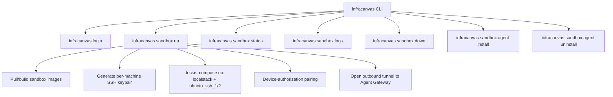

# 06.3 - Sandbox Agent CLI Commands (`infracanvas sandbox`)

## Scope

Extends the existing `infracanvas` CLI (see [[06.1 - InfraCanvas CLI & Reverse Import Tool]]) with a `sandbox` command group that lets a developer stand up the local DevOps Sandbox described in [[03.2 - DevOps Sandbox (LocalStack & SSH Containers)]] and bridge it to the hosted Runner via the tunnel protocol in [[03.6 - Remote Sandbox Agent & Bridging Connection Protocol]] — without cloning the repository.

## Command Reference

### `infracanvas sandbox up`
1. Checks for a local Docker daemon (Docker Desktop, Colima, Podman-compatible socket, etc.); prints a clear remediation message if none is found rather than a raw connection error.
2. Generates a fresh per-machine SSH keypair under `~/.infracanvas/sandbox/` if one does not already exist for this installation — never reuses a shared or repo-committed key (see the key-management note in [[03.6 - Remote Sandbox Agent & Bridging Connection Protocol]]).
3. Pulls the published `infracanvas/sandbox-localstack` and `infracanvas/sandbox-ssh-target` images (or builds them locally from the open `sandbox/` configs — see [[09.2 - Repository & License Split Strategy (Open-Core vs Source-Available)]] for why those configs are permissively licensed) and brings them up via an embedded Compose definition, injecting the freshly generated public key as a build/mount argument instead of a baked-in default.
4. Runs the pairing flow described below if no valid agent token is cached.
5. Starts the Agent process, which opens the outbound tunnel and registers with the Gateway.
6. Prints a status summary: container health, exposed local ports, and tunnel connection state.

### `infracanvas sandbox status`
Shows container health (`docker ps`-equivalent, scoped to the sandbox's project label), the Agent's tunnel connection state (`connected` / `reconnecting` / `disconnected`), and the timestamp of the last successful heartbeat to the Gateway. This is the primary diagnostic surface for "why isn't my deploy reaching my sandbox" support questions, and should be the first thing documented in the `/docs` setup guide.

### `infracanvas sandbox logs [service]`
Tails local container logs (`localstack`, `ubuntu_ssh_1`, `ubuntu_ssh_2`) for local debugging, independent of the Runner's own log stream.

### `infracanvas sandbox down`
Stops and removes the sandbox containers and disconnects the Agent's tunnel. Leaves pulled images cached so the next `sandbox up` is fast.

### `infracanvas sandbox agent install` / `agent uninstall`
Installs or removes the Agent as a background OS service (systemd unit on Linux, `launchd` plist on macOS, Windows Service — the Go `kardianos/service` library covers all three from one codebase) so the tunnel survives terminal closure and machine reboot, without requiring the user to keep a foreground process running. This is the UX decision flagged earlier: default to the foreground process for `sandbox up` in a terminal (simplest to build first), and offer `agent install` as the "set it and forget it" upgrade once the daemon path is built. Ship the foreground mode first; treat the installable-service mode as a fast-follow, not a blocker for initial rollout (see [[08.4 - Local Sandbox Agent Rollout & Migration Plan]]).

## Authentication: Device-Authorization Pairing

The Agent runs unattended and cannot present a login form the way `infracanvas login` does today. Use an OAuth 2.0 Device Authorization Grant style flow (RFC 8628), the same pattern as `gh auth login` or `docker login` on a headless machine:

1. `infracanvas sandbox up` requests a pairing code from the Runner API and prints a short code plus a URL (`https://www.infracanvas.<domain>/pair?code=ABCD-1234`).
2. The user opens that URL in their already-authenticated browser session and approves the pairing, selecting which project/org the Agent should be scoped to.
3. The CLI polls the Runner API until the pairing is approved, then receives a long-lived but revocable **agent token**, scoped to that user/project — never the user's own session JWT.
4. The token is cached under `~/.infracanvas/config.json` alongside the existing login token (see [[06.1 - InfraCanvas CLI & Reverse Import Tool]]); flag OS keychain storage (`keyring`-style libraries exist for Go on all three platforms) as a hardening upgrade over the current plaintext file, applicable to both the login token and the new agent token.

Project/org owners get a management view (new, under existing Project Settings — see [[01.2 - System Architecture & Monorepo Structure]]) listing paired agents with the ability to revoke any one of them, which also gives a clean answer to "how do I know what's connected to my sandbox."

## Protocol Version Negotiation

The Agent and the Gateway must agree on a protocol version at connect time, since the Agent binary on a developer's machine can lag behind the hosted backend indefinitely (unlike the web frontend, which is always the latest deploy). On connect, the Agent reports its version; the Gateway either accepts, warns-and-accepts (older but compatible), or rejects with a clear "run `infracanvas update`" message, rather than failing in an unrelated and confusing way further down the pipeline.

## Cross-Platform Considerations

- **Windows** requires Docker Desktop with the WSL2 backend; document this explicitly, since it's a common source of "it doesn't work" reports that have nothing to do with InfraCanvas itself.
- **Docker Desktop licensing** applies to users at companies above Docker's free-use thresholds — document Podman, Colima, and Rancher Desktop as compatible alternatives up front rather than letting users discover the licensing issue on their own (see [[08.4 - Local Sandbox Agent Rollout & Migration Plan]]).
- Service installation (`agent install`) is the one command whose implementation genuinely differs per OS; budget real engineering time for it rather than treating it as a thin wrapper.

## Related Documents
- [[06.1 - InfraCanvas CLI & Reverse Import Tool]]
- [[06.2 - Build Scripts & Static Binary Distribution]]
- [[03.6 - Remote Sandbox Agent & Bridging Connection Protocol]]
- [[03.2 - DevOps Sandbox (LocalStack & SSH Containers)]]
- [[08.4 - Local Sandbox Agent Rollout & Migration Plan]]
