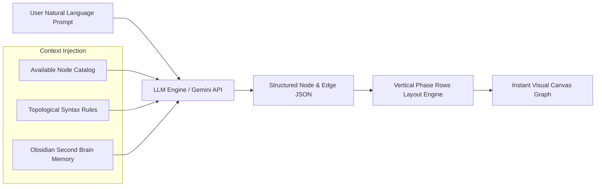

# 08.2 - AI Agent & Prompt-to-Canvas Integration

## Natural Language Infrastructure Generation

A planned milestone for InfraCanvas is enabling users to generate, modify, and audit complex infrastructure topologies using natural language prompts (for example: "Build a high-availability AWS architecture with a VPC, public/private subnets, an Nginx load balancer, and a PostgreSQL RDS database with automated backups").

An early prototype of this concept exists in `infracanvas_mockup.tsx`.



---

## Architecture Specification for the AI Engine

### 1. Catalog-Constrained Generation
The prompt engine injects the list of known modules and parameters into the LLM system prompt. The model outputs a strict JSON schema:
```json
{
  "nodes": [
    { "id": "vpc_1", "tech": "Terraform", "label": "AWS VPC", "parameters": { "cidr_block": "10.0.0.0/16" } },
    { "id": "ec2_1", "tech": "Terraform", "label": "Web EC2", "parameters": { "instance_type": "t3.medium" } },
    { "id": "nginx_1", "tech": "Ansible", "label": "Install Nginx" }
  ],
  "edges": [
    { "source": "vpc_1", "target": "ec2_1" },
    { "source": "ec2_1", "target": "nginx_1" }
  ]
}
```

### 2. Auto-Layout Grid Synthesis
The generated JSON is routed through `importer.ArrangeNodesAndMerge()` to automatically assign non-overlapping coordinates on the canvas.

### 3. AI Security Audit & Best Practices Checker
In addition to generation, the LLM will provide live architecture audits:
- Warning if Security Groups open port 22 (SSH) to `0.0.0.0/0`.
- Warning if RDS database instances are placed in public subnets without encryption.
- Suggesting S3 bucket versioning and TLS termination.

---

## Related Documents
- [[01.1 - Project Vision & Core Paradigm]]
- [[02.4 - HCL and YAML Reverse Importer AST]]
- [[08.1 - Non-Implemented & Mocked Features]]
