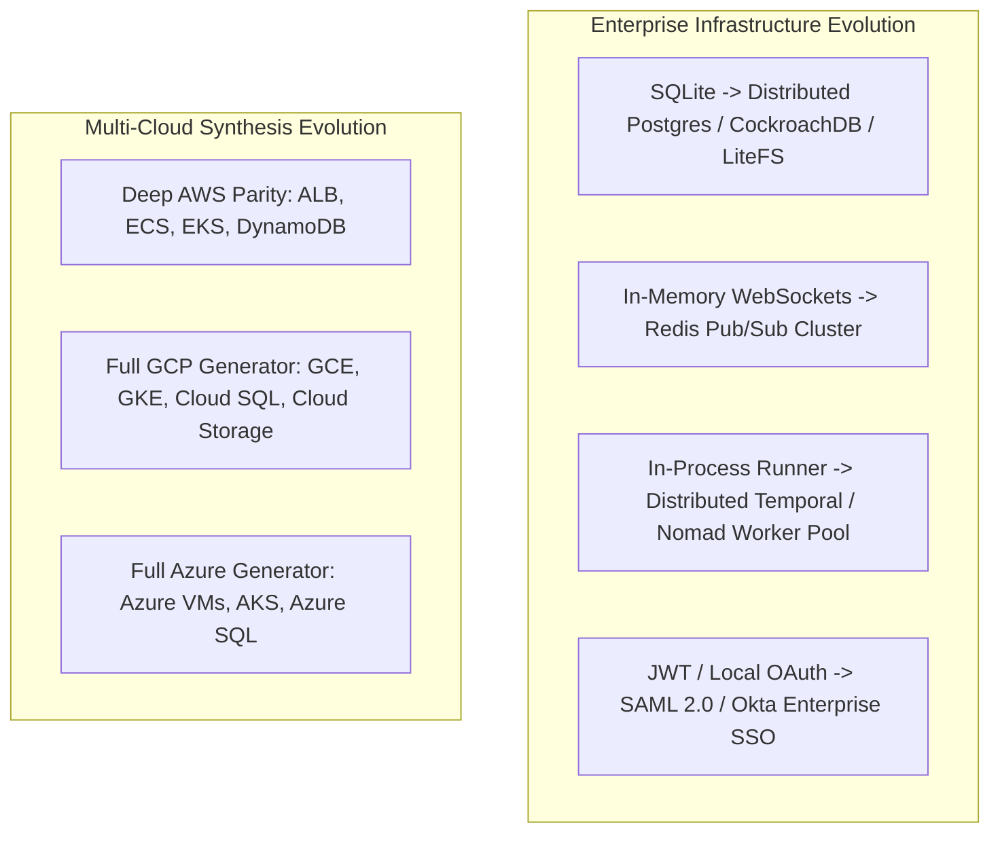

# 08.3 - Enterprise Scalability & Cloud Roadmap

## Scaling Beyond Single-Node

InfraCanvas is currently optimized for local development and single-server deployments. This roadmap outlines architectural evolutions required for high-scale enterprise environments.

---

## Key Evolution Milestones

### 1. Distributed Runner Worker Pool
- Decouple the Go runner from the HTTP API process.
- Use a distributed task queue (e.g. Temporal, NATS, or Celery) so runner jobs execute inside ephemeral, isolated worker containers across a Kubernetes cluster.

### 2. Multi-Cloud Synthesis Expansion
- Expand `bundleGenerator.ts` to achieve 100% feature parity for Google Cloud Platform (GCP) and Microsoft Azure resources alongside AWS.

### 3. Enterprise SSO & Identity Provider Integration
- Add enterprise SAML 2.0 / OIDC integrations (Okta, Azure Active Directory, Google Workspace SAML).
- Add Organization-level audit logging for all provisioning operations.

---

## Related Documents
- [[01.1 - Project Vision & Core Paradigm]]
- [[01.2 - System Architecture & Monorepo Structure]]
- [[07.3 - Design Trade-offs & Pros-Cons Matrix]]
