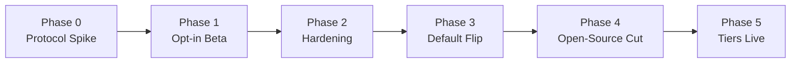

# 08.4 - Local Sandbox Agent Rollout & Migration Plan

## Purpose

Sequencing plan for shifting the DevOps Sandbox from "always hosted, free for everyone" to the tiered model in [[09.1 - Open-Core Business Model & Tiering Strategy]], built on the bridging protocol in [[03.6 - Remote Sandbox Agent & Bridging Connection Protocol]] and the CLI commands in [[06.3 - Sandbox Agent CLI Commands (infracanvas sandbox)]]. Structured so each phase ships something independently useful and reversible, rather than one large cutover.

## Phase 0 — Protocol Spike
Prototype the yamux-over-WebSocket tunnel between two local processes, independent of the real Runner. Validate SSH-exec-over-tunnel and log streaming work end to end against a throwaway "fake local agent" target before touching `runner.go`. Get device-authorization pairing working standalone. Goal: prove the transport, not ship a feature.

**Status: Complete.** Prototyped at `spikes/sandbox-agent-protocol/` (standalone Go module, deliberately outside `apps/` — imports nothing from and is imported by nothing in `apps/api` or `apps/cli`). See its `README.md` for full scope and how to run it. Validated end to end, over real `127.0.0.1` sockets:

- A `gorilla/websocket` connection wrapped as an `io.ReadWriteCloser` carries a `hashicorp/yamux` session cleanly — no custom framing needed beyond that adapter.
- A real `golang.org/x/crypto/ssh` client completes a handshake and runs `exec` requests through a yamux stream tunneled inside a WebSocket, confirming `runner.go`'s eventual approach — re-pointing its existing SSH client at a different `net.Conn` — is viable without a rewrite.
- Log output streams incrementally through the tunnel rather than arriving as one buffered chunk at process exit (asserted via arrival-timestamp spread in the e2e test).
- The Agent-side destination allowlist rejects a dial for a service it never registered, surfaced to the caller as an HTTP 403 from the Gateway before any application bytes cross the tunnel.
- The Gateway rejects a dial whose account/project doesn't match the target Agent's registered scope, before the request ever reaches the Agent — the core tenant-isolation rule from [[03.6 - Remote Sandbox Agent & Bridging Connection Protocol]].
- Device-authorization pairing (RFC 8628-style: `device_code`/`user_code`, browser approval, polling, scoped token issuance) works standalone with no Gateway or networking involved, and is reused by the Gateway's `/device/*` endpoints in the full path.

Explicitly out of scope for Phase 0, carried forward as-is: heartbeat/reconnect UX, daemon install path, load testing, and rate limiting — all still Phase 2 work below.

## Phase 1 — Opt-In Beta

**Status: Complete.** Implemented across `apps/api` (new `apps/api/pairing.go`, `paired_agents` table, `local_agent` branch in `apps/api/runner/runner.go`), a new standalone `apps/agent-gateway` Go module (4th independent module alongside `apps/api`, `apps/cli`, and `spikes/sandbox-agent-protocol` — no `go.work` ties them together), and `apps/cli` (`sandbox up/status/down` plus hidden `agent-run`/`proxy` internal subcommands). Verified end to end over real network sockets: signup → login → project creation → agent key registration (encrypted via the existing `apps/api/vault` AES-256-GCM primitives) → device-authorization pairing (approved through a new authenticated `apps/api` endpoint rather than a browser page — see below) → Agent tunnel connect (flips `paired_agents.status` to `ACTIVE` via a Gateway→API callback) → `infracanvas sandbox proxy` piping real bytes through Runner→Gateway→Agent→a local TCP listener standing in for `ubuntu_ssh_1`. Also verified the two new Phase 1 auth checks reject bad requests: a wrong `X-Gateway-Runner-Secret` on `/runner/dial` returns 401, and a cross-project `project_id` returns 403.

Two corrections to this plan's original premises, discovered while implementing:

1. **No in-process SSH client exists in `apps/api`** to "repoint" at a tunnel `net.Conn`, contrary to what this doc and [[03.6 - Remote Sandbox Agent & Bridging Connection Protocol]] originally assumed — SSH happens by shelling `ansible-playbook` as a subprocess (`apps/api/runner/runner.go`). Phase 1 instead bridges via an SSH **ProxyCommand**: a hidden `infracanvas sandbox proxy` subcommand that OpenSSH itself spawns as a child process, piping stdin/stdout through the Gateway's tunnel — the same pattern Teleport and AWS SSM use for tunneled SSH. `runner.go`'s subprocess model is otherwise unchanged for the `live`/`docker` targets.
2. **Per-installation key custody**: since the Runner still authenticates the SSH session (via `ansible-playbook --private-key`) but that now runs on the hosted Runner's own host, the per-installation private key generated by `infracanvas sandbox up` is uploaded once over the already-authenticated pairing HTTP channel and stored encrypted in a new `paired_agents` table — never as a bare file server-side, and never transmitted outside of that one authenticated upload.

What shipped differs from the original bullet list in one deliberate simplification: device-authorization pairing is approved through a new authenticated `POST /api/projects/{id}/agents/pair` endpoint (which enforces project `EDITOR` role) rather than a dedicated browser approval page — this keeps `sandbox up` fully scriptable without adding an `apps/web` page in this phase, at the cost of the pairing flow not yet demonstrating an independent-device approval UX. A browser-based approval page (letting a *different*, already-logged-in browser session approve a pairing initiated elsewhere) remains a natural follow-up, not a blocker — the Gateway's `/device/approve` is already an internal-only endpoint (shared-secret gated) that such a page would call through the same `apps/api` pairing endpoint.

Original scope (all delivered):
- Added the `local_agent` target type to the Runner alongside the existing `live` and in-container `docker`/sandbox targets.
- Stood up the Agent Gateway as a new, small, independently deployable service (`apps/agent-gateway`).
- Shipped `infracanvas sandbox up/status/down` behind a feature flag (`SANDBOX_AGENT_BETA` on the API, a persisted `sandbox_agent_beta` config field on the CLI). Existing users keep the current in-container sandbox as the default; this phase is additive, not a replacement — confirmed by the pre-existing `runner_test.go` suite passing unmodified.

Explicitly out of scope for Phase 1, carried forward as Phase 2 work: heartbeat/reconnect UX and a "Sandbox Disconnected" status, the daemon install path (`agent install`/`uninstall`), destination-allowlist hardening beyond the Agent's fixed allowlist, rate limiting, and horizontal scaling of the Gateway's in-memory pairing state. See `apps/agent-gateway/README.md` for the full list of known Phase 1 limitations.

**Known gap, not yet planned for anywhere in this doc before this note was added**: `infracanvas sandbox up` currently requires a full repository checkout — it looks for `sandbox/docker-compose.sandbox.yml` and `sandbox/Dockerfile.ssh` relative to the current working directory. This contradicts [[06.3 - Sandbox Agent CLI Commands (infracanvas sandbox)]]'s own stated goal of letting a developer "stand up the local DevOps Sandbox... without cloning the repository." A real free-tier end user who only downloads the `infracanvas` binary (the Phase 3 scenario below) has neither file and `sandbox up` fails immediately. Fix: embed `docker-compose.sandbox.yml` and `Dockerfile.ssh` into the CLI binary at build time (Go `//go:embed`) and write them out to `~/.infracanvas/sandbox/compose/` before invoking `docker compose` against that path instead of a repo-relative one. Tracked explicitly as a Phase 2 prerequisite for Phase 3's default flip below, since Phase 3 structurally requires free-tier signups to run `sandbox up` with no checkout at all.

## Phase 2 — Hardening
- **Zero-clone `sandbox up`**: embed the sandbox's `docker-compose.sandbox.yml`/`Dockerfile.ssh` into the `infracanvas` binary (`//go:embed`) so `sandbox up/status/down` work for a user who only downloaded the CLI, never cloned the repository — see the Phase 1 note above. This is a hard prerequisite for Phase 3, not optional hardening.
- Daemon install path (`agent install`/`uninstall`) for persistence across reboots.
- Heartbeat/reconnect logic and the "Sandbox Disconnected" UI state wired into the existing node-status strip (see [[03.4 - Live Node Status Tracking & Stream Scanning]]).
- Destination allowlisting and per-account rate limiting on the Gateway (see the security section of [[03.6 - Remote Sandbox Agent & Bridging Connection Protocol]]) — do not skip this to hit a date; it is the difference between a tunnel and an open relay.
- Load-test the Gateway relay under concurrent agents before it carries real traffic.

## Phase 3 — Default Flip
- Requires Phase 2's zero-clone `sandbox up` to already be in place — every new free-tier signup hitting this path will not have a repository checkout.
- New free-tier signups default to local-sandbox-only; the in-container hosted sandbox is repositioned as a Pro-tier feature.
- Existing free users on the hosted sandbox get a migration notice and a grace period, not an unannounced cutoff.
- `/docs` setup guide rewritten around `infracanvas sandbox up` as the primary onboarding path.
- This is the phase that actually realizes the cost savings described in [[09.1 - Open-Core Business Model & Tiering Strategy]] — the earlier phases are prerequisites, not the payoff.

## Phase 4 — Open-Source Cut
- Extract `infracanvas-cli` and `infracanvas-sandbox-agent` into separate public repositories under a permissive license, per [[09.2 - Repository & License Split Strategy (Open-Core vs Source-Available)]].
- Publish `sandbox/` Docker configs as their own versioned, contributable artifact (opens the door to community-contributed sandbox targets, e.g. a mock Azure or GCP target alongside the existing LocalStack/AWS one).
- Stand up CONTRIBUTING.md, issue templates, and a CLA bot on the new public repos before soliciting external contributions, not after the first PR arrives.

## Phase 5 — Tiers Live
- Billing integration for Pro/Team/Enterprise gating.
- Community contribution program formalized (accepting new sandbox target types, CLI subcommands, node-authoring SDK improvements).

## Risks & Challenges (Consolidated)

- **NAT traversal / tunnel security scoping** — the core technical risk; covered in depth in [[03.6 - Remote Sandbox Agent & Bridging Connection Protocol]]. Getting the destination allowlist wrong turns a bridging feature into an SSRF-adjacent liability.
- **Reliability UX** — local sandboxes disconnect far more often than hosted ones (sleep, WiFi, VPN). The product must treat "disconnected" as a normal, clearly-communicated state, not an error path bolted on late.
- **Docker Desktop licensing** — not free for companies above Docker's revenue/headcount thresholds; document Podman/Colima/Rancher Desktop alternatives explicitly in the setup guide rather than letting affected users hit a paywall they didn't expect.
- **Windows/WSL2 support burden** — real, ongoing support cost; budget for it rather than treating cross-platform as a checkbox.
- **Protocol/version skew** — CLI installs in the wild will lag the hosted backend indefinitely; version negotiation (see [[06.3 - Sandbox Agent CLI Commands (infracanvas sandbox)]]) must fail clearly, not silently.
- **Relicensing backlash** — pick the license posture in [[09.2 - Repository & License Split Strategy (Open-Core vs Source-Available)]] once and hold it; the Terraform → OpenTofu and Redis → Valkey precedents show what happens when a company tightens terms after building a contributor base on looser ones.
- **Shared key baked into every install** (corrected from an earlier "legacy committed SSH key" framing here — verified via `git log --all --full-history` that `sandbox/id_rsa`/`id_rsa.pub` are gitignored and were never actually committed to this repository's history, so the compromised-by-git-history risk doesn't apply as originally written). The real, still-relevant risk was that every sandbox installation trusted the *same* key pair. Addressed by Phase 1: `infracanvas sandbox up` now generates a fresh per-installation RSA keypair and overwrites `sandbox/id_rsa.pub` with it before building the SSH target containers, per [[06.3 - Sandbox Agent CLI Commands (infracanvas sandbox)]].
- **Gateway cost and abuse surface** — cheap per-account but not free; rate-limit from Phase 2 onward so a free local-sandbox user can't turn the relay into a general-purpose tunnel.
- **Support cost of "works on my machine"** — local sandboxing multiplies environment variance (OS, Docker version, network). `infracanvas sandbox status` needs to be a genuinely good diagnostic tool from Phase 1, not an afterthought, or this shows up as support ticket volume later.

## Related Documents
- [[09.1 - Open-Core Business Model & Tiering Strategy]]
- [[09.2 - Repository & License Split Strategy (Open-Core vs Source-Available)]]
- [[03.6 - Remote Sandbox Agent & Bridging Connection Protocol]]
- [[06.3 - Sandbox Agent CLI Commands (infracanvas sandbox)]]
- [[08.1 - Non-Implemented & Mocked Features]]
- [[08.3 - Enterprise Scalability & Cloud Roadmap]]
