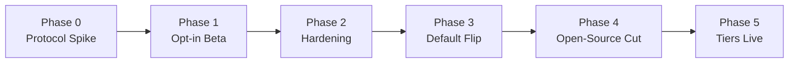

# 08.4 - Local Sandbox Agent Rollout & Migration Plan

## Purpose

Sequencing plan for shifting the DevOps Sandbox from "always hosted, free for everyone" to the tiered model in [[09.1 - Open-Core Business Model & Tiering Strategy]], built on the bridging protocol in [[03.6 - Remote Sandbox Agent & Bridging Connection Protocol]] and the CLI commands in [[06.3 - Sandbox Agent CLI Commands (infracanvas sandbox)]]. Structured so each phase ships something independently useful and reversible, rather than one large cutover.

## Phase 0 — Protocol Spike
Prototype the yamux-over-WebSocket tunnel between two local processes, independent of the real Runner. Validate SSH-exec-over-tunnel and log streaming work end to end against a throwaway "fake local agent" target before touching `runner.go`. Get device-authorization pairing working standalone. Goal: prove the transport, not ship a feature.

**Status: Complete.** Prototyped at `spikes/sandbox-agent-protocol/` (standalone Go module, deliberately outside `apps/` — imports nothing from and is imported by nothing in `apps/api` or `apps/cli`). See its `README.md` for full scope and how to run it. Validated end to end, over real `127.0.0.1` sockets:

- A `gorilla/websocket` connection wrapped as an `io.ReadWriteCloser` carries a `hashicorp/yamux` session cleanly — no custom framing needed beyond that adapter.
- A real `golang.org/x/crypto/ssh` client completes a handshake and runs `exec` requests through a yamux stream tunneled inside a WebSocket, confirming `runner.go`'s eventual approach — re-pointing its existing SSH client at a different `net.Conn` — is viable without a rewrite.
- Log output streams incrementally through the tunnel rather than arriving as one buffered chunk at process exit (asserted via arrival-timestamp spread in the e2e test).
- The Agent-side destination allowlist rejects a dial for a service it never registered, surfaced to the caller as an HTTP 403 from the Gateway before any application bytes cross the tunnel.
- The Gateway rejects a dial whose account/project doesn't match the target Agent's registered scope, before the request ever reaches the Agent — the core tenant-isolation rule from [[03.6 - Remote Sandbox Agent & Bridging Connection Protocol]].
- Device-authorization pairing (RFC 8628-style: `device_code`/`user_code`, browser approval, polling, scoped token issuance) works standalone with no Gateway or networking involved, and is reused by the Gateway's `/device/*` endpoints in the full path.

Explicitly out of scope for Phase 0, carried forward as-is: heartbeat/reconnect UX, daemon install path, load testing, and rate limiting — all still Phase 2 work below.

## Phase 1 — Opt-In Beta
- Add the `local_agent` target type to the Runner alongside the existing `live` and in-container `docker` sandbox targets (extends the target-detection logic noted in [[04.3 - AES-256-GCM Credential Vault & Fingerprinting]]).
- Stand up the Agent Gateway as a new, small, independently deployable service.
- Ship `infracanvas sandbox up/status/down` behind a feature flag. Existing users keep the current in-container sandbox as the default; this phase is additive, not a replacement.

## Phase 2 — Hardening
- Daemon install path (`agent install`/`uninstall`) for persistence across reboots.
- Heartbeat/reconnect logic and the "Sandbox Disconnected" UI state wired into the existing node-status strip (see [[03.4 - Live Node Status Tracking & Stream Scanning]]).
- Destination allowlisting and per-account rate limiting on the Gateway (see the security section of [[03.6 - Remote Sandbox Agent & Bridging Connection Protocol]]) — do not skip this to hit a date; it is the difference between a tunnel and an open relay.
- Load-test the Gateway relay under concurrent agents before it carries real traffic.

## Phase 3 — Default Flip
- New free-tier signups default to local-sandbox-only; the in-container hosted sandbox is repositioned as a Pro-tier feature.
- Existing free users on the hosted sandbox get a migration notice and a grace period, not an unannounced cutoff.
- `/docs` setup guide rewritten around `infracanvas sandbox up` as the primary onboarding path.
- This is the phase that actually realizes the cost savings described in [[09.1 - Open-Core Business Model & Tiering Strategy]] — the earlier phases are prerequisites, not the payoff.

## Phase 4 — Open-Source Cut
- Extract `infracanvas-cli` and `infracanvas-sandbox-agent` into separate public repositories under a permissive license, per [[09.2 - Repository & License Split Strategy (Open-Core vs Source-Available)]].
- Publish `sandbox/` Docker configs as their own versioned, contributable artifact (opens the door to community-contributed sandbox targets, e.g. a mock Azure or GCP target alongside the existing LocalStack/AWS one).
- Stand up CONTRIBUTING.md, issue templates, and a CLA bot on the new public repos before soliciting external contributions, not after the first PR arrives.

## Phase 5 — Tiers Live
- Billing integration for Pro/Team/Enterprise gating.
- Community contribution program formalized (accepting new sandbox target types, CLI subcommands, node-authoring SDK improvements).

## Risks & Challenges (Consolidated)

- **NAT traversal / tunnel security scoping** — the core technical risk; covered in depth in [[03.6 - Remote Sandbox Agent & Bridging Connection Protocol]]. Getting the destination allowlist wrong turns a bridging feature into an SSRF-adjacent liability.
- **Reliability UX** — local sandboxes disconnect far more often than hosted ones (sleep, WiFi, VPN). The product must treat "disconnected" as a normal, clearly-communicated state, not an error path bolted on late.
- **Docker Desktop licensing** — not free for companies above Docker's revenue/headcount thresholds; document Podman/Colima/Rancher Desktop alternatives explicitly in the setup guide rather than letting affected users hit a paywall they didn't expect.
- **Windows/WSL2 support burden** — real, ongoing support cost; budget for it rather than treating cross-platform as a checkbox.
- **Protocol/version skew** — CLI installs in the wild will lag the hosted backend indefinitely; version negotiation (see [[06.3 - Sandbox Agent CLI Commands (infracanvas sandbox)]]) must fail clearly, not silently.
- **Relicensing backlash** — pick the license posture in [[09.2 - Repository & License Split Strategy (Open-Core vs Source-Available)]] once and hold it; the Terraform → OpenTofu and Redis → Valkey precedents show what happens when a company tightens terms after building a contributor base on looser ones.
- **Legacy committed SSH key** — `sandbox/id_rsa` / `id_rsa.pub` currently live in the repository; independent of this rollout, that keypair should be treated as compromised and replaced by the per-installation keygen described in [[06.3 - Sandbox Agent CLI Commands (infracanvas sandbox)]], ideally before Phase 1 rather than as part of it.
- **Gateway cost and abuse surface** — cheap per-account but not free; rate-limit from Phase 2 onward so a free local-sandbox user can't turn the relay into a general-purpose tunnel.
- **Support cost of "works on my machine"** — local sandboxing multiplies environment variance (OS, Docker version, network). `infracanvas sandbox status` needs to be a genuinely good diagnostic tool from Phase 1, not an afterthought, or this shows up as support ticket volume later.

## Related Documents
- [[09.1 - Open-Core Business Model & Tiering Strategy]]
- [[09.2 - Repository & License Split Strategy (Open-Core vs Source-Available)]]
- [[03.6 - Remote Sandbox Agent & Bridging Connection Protocol]]
- [[06.3 - Sandbox Agent CLI Commands (infracanvas sandbox)]]
- [[08.1 - Non-Implemented & Mocked Features]]
- [[08.3 - Enterprise Scalability & Cloud Roadmap]]
