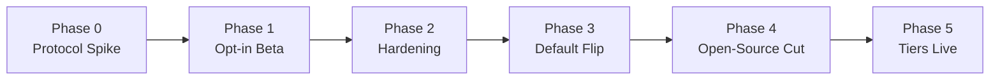

# 08.4 - Local Sandbox Agent Rollout & Migration Plan

## Purpose

Sequencing plan for shifting the DevOps Sandbox from "always hosted, free for everyone" to the tiered model in [[09.1 - Open-Core Business Model & Tiering Strategy]], built on the bridging protocol in [[03.6 - Remote Sandbox Agent & Bridging Connection Protocol]] and the CLI commands in [[06.3 - Sandbox Agent CLI Commands (infracanvas sandbox)]]. Structured so each phase ships something independently useful and reversible, rather than one large cutover.

## Phase 0 — Protocol Spike
Prototype the yamux-over-WebSocket tunnel between two local processes, independent of the real Runner. Validate SSH-exec-over-tunnel and log streaming work end to end against a throwaway "fake local agent" target before touching `runner.go`. Get device-authorization pairing working standalone. Goal: prove the transport, not ship a feature.

**Status: Complete.** Prototyped at `spikes/sandbox-agent-protocol/` (standalone Go module, deliberately outside `apps/` — imports nothing from and is imported by nothing in `apps/api` or `apps/cli`). See its `README.md` for full scope and how to run it. Validated end to end, over real `127.0.0.1` sockets:

- A `gorilla/websocket` connection wrapped as an `io.ReadWriteCloser` carries a `hashicorp/yamux` session cleanly — no custom framing needed beyond that adapter.
- A real `golang.org/x/crypto/ssh` client completes a handshake and runs `exec` requests through a yamux stream tunneled inside a WebSocket, confirming `runner.go`'s eventual approach — re-pointing its existing SSH client at a different `net.Conn` — is viable without a rewrite.
- Log output streams incrementally through the tunnel rather than arriving as one buffered chunk at process exit (asserted via arrival-timestamp spread in the e2e test).
- The Agent-side destination allowlist rejects a dial for a service it never registered, surfaced to the caller as an HTTP 403 from the Gateway before any application bytes cross the tunnel.
- The Gateway rejects a dial whose account/project doesn't match the target Agent's registered scope, before the request ever reaches the Agent — the core tenant-isolation rule from [[03.6 - Remote Sandbox Agent & Bridging Connection Protocol]].
- Device-authorization pairing (RFC 8628-style: `device_code`/`user_code`, browser approval, polling, scoped token issuance) works standalone with no Gateway or networking involved, and is reused by the Gateway's `/device/*` endpoints in the full path.

Explicitly out of scope for Phase 0, carried forward as-is: heartbeat/reconnect UX, daemon install path, load testing, and rate limiting — all still Phase 2 work below.

## Phase 1 — Opt-In Beta

**Status: Complete.** Implemented across `apps/api` (new `apps/api/pairing.go`, `paired_agents` table, `local_agent` branch in `apps/api/runner/runner.go`), a new standalone `apps/agent-gateway` Go module (4th independent module alongside `apps/api`, `apps/cli`, and `spikes/sandbox-agent-protocol` — no `go.work` ties them together), and `apps/cli` (`sandbox up/status/down` plus hidden `agent-run`/`proxy` internal subcommands). Verified end to end over real network sockets: signup → login → project creation → agent key registration (encrypted via the existing `apps/api/vault` AES-256-GCM primitives) → device-authorization pairing (approved through a new authenticated `apps/api` endpoint rather than a browser page — see below) → Agent tunnel connect (flips `paired_agents.status` to `ACTIVE` via a Gateway→API callback) → `infracanvas sandbox proxy` piping real bytes through Runner→Gateway→Agent→a local TCP listener standing in for `ubuntu_ssh_1`. Also verified the two new Phase 1 auth checks reject bad requests: a wrong `X-Gateway-Runner-Secret` on `/runner/dial` returns 401, and a cross-project `project_id` returns 403.

Two corrections to this plan's original premises, discovered while implementing:

1. **No in-process SSH client exists in `apps/api`** to "repoint" at a tunnel `net.Conn`, contrary to what this doc and [[03.6 - Remote Sandbox Agent & Bridging Connection Protocol]] originally assumed — SSH happens by shelling `ansible-playbook` as a subprocess (`apps/api/runner/runner.go`). Phase 1 instead bridges via an SSH **ProxyCommand**: a hidden `infracanvas sandbox proxy` subcommand that OpenSSH itself spawns as a child process, piping stdin/stdout through the Gateway's tunnel — the same pattern Teleport and AWS SSM use for tunneled SSH. `runner.go`'s subprocess model is otherwise unchanged for the `live`/`docker` targets.
2. **Per-installation key custody**: since the Runner still authenticates the SSH session (via `ansible-playbook --private-key`) but that now runs on the hosted Runner's own host, the per-installation private key generated by `infracanvas sandbox up` is uploaded once over the already-authenticated pairing HTTP channel and stored encrypted in a new `paired_agents` table — never as a bare file server-side, and never transmitted outside of that one authenticated upload.

What shipped differs from the original bullet list in one deliberate simplification: device-authorization pairing is approved through a new authenticated `POST /api/projects/{id}/agents/pair` endpoint (which enforces project `EDITOR` role) rather than a dedicated browser approval page — this keeps `sandbox up` fully scriptable without adding an `apps/web` page in this phase, at the cost of the pairing flow not yet demonstrating an independent-device approval UX. A browser-based approval page (letting a *different*, already-logged-in browser session approve a pairing initiated elsewhere) remains a natural follow-up, not a blocker — the Gateway's `/device/approve` is already an internal-only endpoint (shared-secret gated) that such a page would call through the same `apps/api` pairing endpoint.

Original scope (all delivered):
- Added the `local_agent` target type to the Runner alongside the existing `live` and in-container `docker`/sandbox targets.
- Stood up the Agent Gateway as a new, small, independently deployable service (`apps/agent-gateway`).
- Shipped `infracanvas sandbox up/status/down` behind a feature flag (`SANDBOX_AGENT_BETA` on the API, a persisted `sandbox_agent_beta` config field on the CLI). Existing users keep the current in-container sandbox as the default; this phase is additive, not a replacement — confirmed by the pre-existing `runner_test.go` suite passing unmodified.

Explicitly out of scope for Phase 1, carried forward as Phase 2 work: heartbeat/reconnect UX and a "Sandbox Disconnected" status, the daemon install path (`agent install`/`uninstall`), destination-allowlist hardening beyond the Agent's fixed allowlist, rate limiting, and horizontal scaling of the Gateway's in-memory pairing state. See `apps/agent-gateway/README.md` for the full list of known Phase 1 limitations.

**Known gap, resolved by Phase 2's "Zero-clone `sandbox up`" below**: `infracanvas sandbox up` originally required a full repository checkout — it looked for `sandbox/docker-compose.sandbox.yml` and `sandbox/Dockerfile.ssh` relative to the current working directory. This contradicted [[06.3 - Sandbox Agent CLI Commands (infracanvas sandbox)]]'s own stated goal of letting a developer "stand up the local DevOps Sandbox... without cloning the repository." A real free-tier end user who only downloads the `infracanvas` binary (the Phase 3 scenario below) had neither file and `sandbox up` failed immediately. Kept here as the historical record of the gap; see the Phase 2 entry for what shipped.

### Post-launch hardening found via real end-to-end testing

Phase 1 was marked complete after passing automated tests and a scripted manual pass, but real usage (real Docker builds, the actual web UI, real canvases) surfaced a run of real bugs — none in the Phase 0 spike's transport itself, all in how Phase 1 wired into the existing Runner/API. Recorded here since several are non-obvious interactions Phase 2 needs to be aware of:

1. **`aws_key_pair` "Key is not in valid OpenSSH public key format"** — pre-existing bug, unmasked by this rollout. `bundleGenerator.ts` bakes a syntactically-invalid dummy placeholder into `variables.tf`'s `aws_ssh_pub_key` default; `apps/api/main.go` only overrode it with a real key when a project SSH credential existed. LocalStack's mocked `ImportKeyPair` doesn't validate format (silently "worked"); real AWS correctly rejects it. Fix: `extractSecretsAndEnvironment` falls back to the real `sandbox/id_rsa.pub` content when no credential is configured — **but only for a LocalStack sandbox run** (see next point).
2. **SSH credential must be mandatory for live cloud, never silently defaulted** — the first fix above initially applied unconditionally, which meant a *live* AWS/GCP/Azure deploy with no configured credential would have silently imported the shared sandbox keypair into a real cloud account (exactly the "shared key baked into every install" risk this doc already flags elsewhere, just via a new code path). Fixed with a single pre-flight check in `handleDeploy`: `runner.IsSandbox(canvasStr) == false && no SSH credential` now rejects the deploy immediately with a clear `400` before any pipeline run is created, rather than either succeeding wrongly or failing confusingly deep inside a Terraform provider error later.
3. **`isSandbox()` treated a missing `environment` field as "live"** — the frontend's AWS Target inspector only *writes* an explicit `environment` value into node data once the user touches the dropdown; a freshly-dropped node just *displays* "LocalStack (Sandbox)" as a UI default without persisting it. So the backend saw no environment key at all on the common case (a node nobody has touched the dropdown on) and treated it as live, triggering point 2's new rejection incorrectly. Fixed: absent/empty `environment` is now treated the same as explicit `"localstack"`; only an explicit non-localstack value counts as live. Regression-tested in `runner_test.go`.
4. **`local_agent` + a separately-configured project SSH credential silently discarded the tunnel** — the pre-existing "inject custom SSH key into hosts.ini" block (unrelated to this rollout, used for real-server Ansible targets) is unconditional. Ansible's inventory-level `ansible_ssh_private_key_file`/`ansible_ssh_common_args` vars take precedence over the `--private-key`/`--ssh-common-args` CLI flags `local_agent`'s ProxyCommand sets, so whenever a project had *both* a paired agent and its own SSH credential, the credential's INI vars silently won, discarding the ProxyCommand tunnel and attempting (and failing) a direct connection to the placeholder host `agent-tunnel`. Fixed by skipping that block entirely when `isLocalAgentRun` is true — `local_agent` fully owns SSH transport via its own CLI flags. A real, non-obvious interaction between old and new code paths; worth remembering if Phase 2 adds more SSH-key sources.
5. **`terraform init -reconfigure -input=false` failed on backend state migration** — whenever a workspace's S3-backend (LocalStack-mocked) state needed migrating between runs, Terraform wanted an interactive yes/no it can't get with `-input=false`, failing outright with "Can't ask approval for state migration." Fixed by adding `-force-copy` (equivalent to auto-answering yes) — safe here since it's Terraform's own throwaway sandbox/live state, not user data.
6. **The production API Docker image never actually had the `infracanvas` CLI binary in it** — `apps/api/Dockerfile`'s original build context was `./apps/api`, which can't reach `apps/cli`. Every `local_agent` deploy through the containerized API would have failed at the `sandbox proxy` ProxyCommand step with "executable file not found," a gap this doc previously (incorrectly) assumed was already handled by "the existing CLI release pipeline." Fixed by widening the build context to the repo root (`docker-compose.yml`'s `api` service updated to match) and adding a build stage that compiles `apps/cli` into the final image on `PATH`. Needed a `.dockerignore` at the repo root once the context widened (previously builds picked up hundreds of MB of `apps/api/data/` runtime state — Docker doesn't consult `.gitignore`).
7. **`docker-compose.hosted.yml` was missing the `./sandbox:/app/sandbox` mount** the main `docker-compose.yml` has — reproduced bug #1 all over again, but only on that one compose file, since `readSandboxPublicKey()` had nothing to read there. Fixed by adding the mount (read-only — the hosted API container only ever reads the fallback key, never writes it; writing a fresh per-installation key is `sandbox up`'s job on the separate local-machine stack).
8. **Compose project-name collisions** — see [[03.2 - DevOps Sandbox (LocalStack & SSH Containers)]] for the full incident; every Compose invocation in this rollout now uses an explicit project name so the three Compose files (root, hosted, sandbox) can never merge into each other's containers.
9. **`AgentContext` didn't carry `ProjectID`** — the ProxyCommand string `local_agent` builds never actually passed `--project=...`; it "worked" only in ad-hoc manual testing where the project ID was hand-set via an env var a real deploy never sets. Fixed by adding `ProjectID` to `runner.AgentContext`, populated by `resolvePairedAgent`.

None of these were found by the automated test suite — all found by actually running real deploys against real Docker, through the real web UI, with real (and realistically incomplete/stale) canvas state. Reinforces the standing instruction in this repo to verify a phase's actual behavior, not just its test suite, before building on top of it.

## Phase 2 — Hardening

### Zero-clone `sandbox up`

**Status: Complete.** `apps/cli/embedded/sandbox/docker-compose.sandbox.yml` and `apps/cli/embedded/sandbox/Dockerfile.ssh` — byte-for-byte copies of the root `sandbox/` files root `docker-compose.yml` still builds from — are embedded into the `infracanvas` binary via `//go:embed` (`apps/cli/embedded.go`). `sandbox up`/`down` now call `extractEmbeddedSandboxFiles()` to write both files into `~/.infracanvas/sandbox/compose/` unconditionally on every invocation, and point `docker compose -f` there instead of at a repo-relative `sandbox/` path; the per-installation SSH public key is written into that same extracted directory rather than into a checkout. `apps/cli/embedded_sandbox_test.go` guards the two embedded copies against drifting from their root `sandbox/` originals (skips gracefully if run outside a full monorepo checkout), and `.github/workflows/cli-release.yml` now runs `go test ./...` before building so this guard has teeth in CI. `sandbox up/status/down` work for a user who only downloaded the CLI binary, never cloned the repository — resolving the Phase 1 "Known gap" noted above. This was a hard prerequisite for Phase 3, not optional hardening.

One incidental behavior change: `sandbox up` run from a checkout previously mutated the repo's own `sandbox/id_rsa.pub` in place — which happened to be the same file `apps/api`'s hosted in-container flow (`readSandboxPublicKey()` in `main.go`) falls back to when no project SSH credential is configured. That coupling was undocumented and likely accidental; `sandbox up` no longer touches the checkout at all, so it no longer refreshes that hosted-flow fallback key as a side effect. `apps/api` itself is untouched by this change and its fallback behavior is otherwise unaffected.

### Destination allowlisting + per-account rate limiting on the Gateway

**Status: Complete.** The Gateway previously had no destination allowlist of its own — `handleRunnerDial` forwarded whatever `service` string the Runner supplied straight to the Agent and trusted the Agent's own per-stream ack/reject as the sole enforcement point, and had no concurrency cap or byte-rate throttling anywhere. Both are now enforced Gateway-side, independent of the Agent:

- **Allowlisting**: the Agent now declares its allowlist to the Gateway itself, at connect time, via a required `allowed_services` query param on `/agent/connect` (comma-separated, e.g. `ssh:2222,ssh:2223`) — the "Agent itself defines" model from [[03.6 - Remote Sandbox Agent & Bridging Connection Protocol]]'s security section, point 1. `handleRunnerDial` in `apps/agent-gateway/internal/server/server.go` checks a dial's `service` against this set and returns `403` before ever opening a stream to the Agent, closing the gap where a bug in the Agent's own check would have been the only thing standing between this tunnel and an open relay.
- **Rate limiting**: `Server` now tracks concurrent stream counts and a `golang.org/x/time/rate` token bucket per `project_id` (point 6 of the same section — "per account" maps to "per `project_id`" in this codebase, which has no account concept). Concurrency is capped at `--max-streams-per-project` (default 10) — `429` past that. Bytes/sec are capped at `--bytes-per-sec-per-project` (default 2 MiB/s), shared across all of a project's concurrent streams in both directions via `splice()`'s new `rateLimitedReader`. Both are `apps/agent-gateway/cmd/agent-gateway/main.go` flags, sized for a dev-sandbox workload (interactive SSH/Ansible output, not bulk transfer) as starting points — the separate "Load-test the Gateway" bullet below is where these get tuned with real data, not this item.
- Covered by five new tests in `apps/agent-gateway/internal/server/server_test.go` (previously zero test files existed in this module): allowlist rejection, concurrency-cap rejection and release, rate-limit throttling, and a slot-leak regression test for the "Agent rejects after the Gateway already acquired a slot" path.
- While touching the allowlist, also fixed an adjacent bug: `apps/cli/sandboxagent.go`'s Agent allowlist only ever permitted `ssh:2222`, even though the sandbox brings up two SSH containers (`ubuntu_ssh_1`:2222, `ubuntu_ssh_2`:2223). It now permits both and reports both via `allowed_services`. **This does not by itself make `ubuntu_ssh_2` reachable end-to-end**: `apps/api/runner/runner.go:184` still hardcodes `--service=ssh:2222` in the ProxyCommand it builds for every `local_agent` run — a follow-up `apps/api` change (out of scope here, same module boundary as the zero-clone item above) is needed to actually request `ssh:2223` for a node that needs it.
- **Build gotcha found afterward, fixed**: adding `golang.org/x/time` bumped `apps/agent-gateway/go.mod`'s `go` directive to `1.25.0` (that module's own minimum), but `apps/agent-gateway/Dockerfile` was still pinned to `FROM golang:1.23`, and the `golang` base images ship with `GOTOOLCHAIN=local` (no auto-download) — so `docker compose -f docker-compose.hosted.yml up --build` failed at `go mod download` with a non-obvious `exit code: 1`, no version-mismatch message surfaced in the compose error output itself (it only showed up by reading the build log directly). Fixed by adding `GOTOOLCHAIN=auto` to the Dockerfile's `go mod download`/`go build` steps, matching the exact pattern `apps/api/Dockerfile` already established for its `apps/cli` sub-build (which anticipated this same class of problem). See [[07.2 - Technical Pitfalls & Edge Cases]] for the general pitfall entry — any future dependency bump that raises a module's `go` directive above its Dockerfile's pinned base image will hit this same failure mode.
- **Explicitly out of scope, left open**: `/runner/dial`'s auth is still a single shared secret (`X-Gateway-Runner-Secret`) shared by every Runner instance, not per-Runner-instance credentials — already tracked in `apps/agent-gateway/README.md`'s "Known Phase 1 limitations" and not part of this bullet's scope.

### Heartbeat/reconnect logic + "Sandbox Disconnected" state

**Status: Complete (backend/CLI only — no canvas UI, by deliberate scope decision).** The original bullet wording ("wired into the existing node-status strip") doesn't hold up: that WebSocket channel (see [[03.4 - Live Node Status Tracking & Stream Scanning]]) is scoped to a single pipeline *run*, not persistent agent-connection state, and no live-push channel or frontend component existed for the latter. Building one is a real, separate `apps/web` feature, deliberately deferred — `infracanvas sandbox status` (polling `GET /api/projects/{id}/agents/{agentId}`) remains the interim UX for seeing connection state.

**Detection was already free — no new protocol was built.** Both the Gateway (`handleAgentConnect`) and the Agent (`connectAndServe`) use `yamux.DefaultConfig()`, which pings every 30s with a 10s pong timeout — a dead tunnel already closes the yamux session within roughly 30-40s on its own via `session.CloseChan()`. The actual gap was that nothing reacted to that signal: the Gateway notified `apps/api` of `ACTIVE` on connect but never notified anything on disconnect, so `paired_agents.status` stayed `'ACTIVE'` forever after a real disconnect.

What shipped:
- **Gateway** (`apps/agent-gateway/internal/server/server.go`): `handleAgentConnect` now calls `NotifyStatus(agentID, "DISCONNECTED")` when `session.CloseChan()` fires, guarded by an `isCurrentSession` check so a session a reconnect already replaced doesn't send a stale notify. This narrows, but does not fully eliminate, a residual race between a fast reconnect's `ACTIVE` notify and the old session's `DISCONNECTED` notify arriving out of order over independent HTTP requests — accepted as a known residual risk, not engineered away further.
- **`apps/api`**: `paired_agents.status`'s CHECK constraint widened to allow `DISCONNECTED` (`PENDING`, `ACTIVE`, `REVOKED`, `DISCONNECTED`), via a new `migratePairedAgentsStatusAllowsDisconnected()` in `pairing.go` following the exact create/copy/drop/rename pattern `oauth.go`'s `migrateUsersPasswordHashNullable` already established (SQLite has no `ALTER TABLE ... ALTER COLUMN`, and a CHECK constraint isn't visible via `PRAGMA table_info`, so this inspects `sqlite_master.sql` directly). `handleAgentStatusCallback` now accepts `DISCONNECTED`. A real, adjacent bug this surfaced: `RunPipeline`'s `isLocalAgentRun` branch (`apps/api/runner/runner.go`) is project-wide and automatic whenever `resolvePairedAgent` finds an `ACTIVE` row — so once disconnect is tracked correctly, the very next deploy or destroy would otherwise silently fall back to the in-container Docker sandbox instead of failing clearly. Fixed with a new `latestPairedAgentStatus()` helper and a pre-flight `400` rejection in both `handleDeploy` and `handleDestroy` (mirroring the existing SSH-credential pre-flight check's style) whenever a project's most-recently-registered paired agent is `PENDING` or `DISCONNECTED`. A `REVOKED` latest agent is deliberately **not** blocked — that means the user intentionally disabled the integration, so it correctly falls back to normal behavior exactly like "never paired."
- **CLI** (`apps/cli/sandboxagent.go`): `runSandboxAgentRun` restructured into an outer reconnect loop around a new `connectAndServe` (dial once, serve until the session dies, return — never `log.Fatal`s, so it's independently testable and safely re-callable) plus a small pure `reconnectBackoff` (1s→2s→4s→...→30s cap, reset to 1s after a connection stays up ≥60s). Reconnecting reuses the same long-lived `INFRACANVAS_AGENT_TOKEN` — confirmed safe since the Gateway's `pairing.LookupToken` isn't single-use. No new wiring needed for visibility: `startAgentProcess` already redirects this process's output to `~/.infracanvas/sandbox/<agentID>.log`.
- **Deliberate simplification versus [[06.3 - Sandbox Agent CLI Commands (infracanvas sandbox)]]'s original "connected/reconnecting/disconnected" wording**: no distinct `RECONNECTING` DB status was built. The Agent's reconnect attempts happen entirely client-side after the Gateway has already reported `DISCONNECTED`; a successful reconnect's own `ACTIVE` notify is what "recovers" the status. 06.3 corrected to match.
- **Tests**: one new Gateway test (`TestGatewayReportsDisconnectedOnSessionClose`) proving the notify fires on session close; CLI backoff shape and `connectAndServe`'s safe-reconnect property both unit-tested against a small local fake gateway. `apps/api`'s migration and pre-flight check are **manual-verification-only** — the root `api` package has zero existing test files and no test-friendly DB bootstrap extraction, and building that infrastructure is a separate, disproportionate change for this item; flagged here rather than silently skipped.
- **Found via manual verification of this exact item**: the first live `ACTIVE` notify after deploying this failed with a bare `500`, root-caused to a pre-existing SQLite concurrency gap (`apps/api` had no `SetMaxOpenConns`/`busy_timeout`) that this item's added write traffic (a boot-time migration plus more frequent status notifies) made likely to actually collide. Fixed in `main.go`; full incident and the accompanying error-visibility fixes (neither service surfaced the real DB error until this was debugged) are in [[07.2 - Technical Pitfalls & Edge Cases]].
- **A second real gap, found via later manual end-to-end testing of the whole Phase 2 flow**: stopping the Gateway process itself (`docker stop`/restarting the container) — as opposed to an Agent's tunnel dying under a still-running Gateway — left `paired_agents.status` stuck at `ACTIVE` forever. The original design only handled the Gateway noticing a dead Agent connection; it never handled the Gateway itself going away, since nothing is left alive at that point to detect or report anything. Fixed with `Server.Shutdown()` (`server.go`) plus a `SIGTERM`/`SIGINT` handler in `cmd/agent-gateway/main.go`: on a graceful stop, the Gateway now notifies `DISCONNECTED` for every currently-connected agent before exiting, using the grace period `docker stop`/systemd/k8s all give before force-killing. Covered by a new test, `TestServerShutdownNotifiesAllConnectedAgents`. **Still not covered**: a hard crash or `SIGKILL` (OOM, `docker kill`, power loss) runs no shutdown code at all, so status can still go stale in that narrower case — an accepted residual gap, the same category as the reconnect-notify race noted above, not solved here.

### Load-test the Gateway relay under concurrent agents

**Status: Complete.** `apps/agent-gateway/internal/server/loadtest_test.go` (new, gated behind `RUN_GATEWAY_LOAD_TEST=1` so routine `go test ./...` stays fast — see the Gateway's README) drives the actual shipped defaults (`MaxStreamsPerProject=10`, `BytesPerSecPerProject=2MiB/s`) with 20 concurrent projects × 50 concurrent dial attempts each (1000 total), deliberately exceeding the cap to force real contention rather than just exercising the happy path. Run with `-race` inside a Linux container (this Windows dev machine's gcc can't build the race detector's cgo runtime — see [[07.2 - Technical Pitfalls & Edge Cases]]): **zero data races found across 8+ forced re-runs (`-count=1`)**, confirming `acquireStreamSlot`/`releaseStreamSlot`'s mutex-protected counter is correctly synchronized under genuine concurrent load, not just the sequential calls the existing tests make.

Real numbers from one run, logged for future tuning reference: 1000 total dial attempts in 1.33s (750 dials/sec against an in-process test Gateway), 358 succeeded, 642 correctly rejected with `429`. At this scale the shipped defaults (10 streams / 2 MiB/s per project) hold up fine — no tuning change made; the separate "Load-test the Gateway" bullet this replaces existed specifically to validate those numbers with real data rather than leave them as untested guesses, and they're now validated.

**A genuine, non-obvious finding, not a bug**: the test's first iteration deliberately measures concurrency *externally* — via an independent counter on the local TCP listener each fake Agent proxies to, not the Gateway's own `streamCounts` map — specifically so the check isn't tautological. That surfaced a small, real, and correctly-understood overshoot (observed up to ~11 concurrent connections against a cap of 10) caused by asynchronous teardown propagation: `releaseStreamSlot`'s defer in `handleRunnerDial` fires in lockstep with closing the yamux stream, but that close signal still has to propagate across the tunnel (Gateway → WebSocket → Agent → the Agent's own `local.Close()`) before the underlying TCP connection actually tears down — a released Gateway slot briefly overlapping with the connection it belonged to. Confirmed via `-race` finding nothing across every run, including the ones that saw this overshoot, this is teardown lag, not a double-grant race. The test's tolerance was widened (a documented `concurrencyOvershootTolerance = 5`) to absorb this expected, bounded artifact of multi-hop measurement while still catching a genuine "cap not enforced" regression, which would show far more than a handful of extra connections.

### Daemon install path (`sandbox agent install`/`uninstall`)

**Status: Complete.** `apps/cli/sandboxservice.go` (new) installs the local Sandbox Agent as a persistent OS service — a per-user systemd unit on Linux, a per-user launchd agent on macOS, or a Windows Service — via `github.com/kardianos/service` (pure Go, no cgo; confirmed safe for the existing `CGO_ENABLED=0` release matrix by cross-compiling all five `cli-release.yml` targets, linux/darwin amd64+arm64 and windows/amd64, clean). `sandbox agent-run` (the existing plain foreground/background-process path `sandbox up` spawns) is untouched; a new hidden `sandbox agent-service-run` is the actual OS-invoked entry point, sharing the same reconnect loop via a small refactor.

Real design gaps found and fixed while building this, not present in the original plan:
- **Token persistence**: the agent token previously only ever existed as an env var handed to one spawned process — never on disk. A service must read it fresh on every start, including after a reboot long after `sandbox up` exited. Fixed by having `sandbox up` also write it to `~/.infracanvas/sandbox/<agentID>_token` (mode `0600`, same permission pattern as the per-installation SSH private key); `resolveAgentToken` prefers the env var (unchanged for the plain process path) and falls back to this file. [[06.3 - Sandbox Agent CLI Commands (infracanvas sandbox)]]'s original claim that the agent token would be cached in `config.json` alongside the login token was never actually implemented that way — corrected there.
- **Graceful stop**: `kardianos/service`'s `Stop()` callback must return promptly, but `connectAndServe` previously had no way to be interrupted short of the process dying. Gave it a `context.Context` parameter and a watcher goroutine that closes the yamux session on cancellation, unblocking `Accept()` immediately instead of waiting up to yamux's ~30-40s keepalive timeout. `runAgentReconnectLoop` (extracted from `runSandboxAgentRun`, now shared by both the plain command and the service program) checks `ctx.Err()` around both the connect attempt and the backoff sleep so it exits cleanly rather than reconnecting after `Stop()`.
- **Double-spawn avoidance**: `sandbox up` now checks whether the service is already running (`agentServiceIsRunning`) before spawning its own raw background process, so a user who already installed the service doesn't end up with two agent processes racing the same `agent_id` against the Gateway.
- **Re-running `install` is safe**: it best-effort stops+uninstalls any prior registration before installing fresh, so re-pairing with a different project and re-running `install` replaces the service in place rather than erroring on "already exists." The service uses one fixed name (`infracanvas-sandbox-agent`), matching the existing single-active-agent-per-machine model (`sandboxState`/`state.json`) — not one service per project.
- **Windows always needs elevation**; Linux/macOS don't, via `kardianos/service`'s `Option: service.KeyValue{"UserService": true}` (a per-user systemd/launchd registration, no root/sudo) — documented explicitly rather than assumed uniform across platforms.

**Tests**: `connectAndServe`'s context-cancellation is unit-tested (proves it returns within 2s of `cancel()`, the property `Stop()` depends on being prompt) against the existing local fake-gateway pattern; `resolveAgentToken`'s env-var-vs-file precedence and missing-both error path are both unit-tested. **The actual OS-service install/uninstall (the `kardianos/service` integration itself) is manual-verification-only** — installing/uninstalling a real Windows Service, systemd user unit, or launchd agent needs real OS state and, on Windows, elevated privileges; automating that is disproportionate for a unit test. Flagged here rather than silently skipped, matching every other manual-only gap recorded across this Phase 2 pass.

---

**Phase 2 (Hardening) is now fully complete** — all five items (zero-clone `sandbox up`, Gateway allowlisting + rate limiting, heartbeat/reconnect + disconnect detection, Gateway load testing, and this daemon-install path) are shipped, tested to the extent each honestly allows, and documented above with their real findings, deliberate simplifications, and known residual gaps. Phase 3's stated prerequisite — a checkout-less, hardened, load-validated `sandbox up` — is satisfied; what remains for Phase 3 is the product/rollout decision of actually flipping the default for new signups, not further engineering on this Phase's scope.

### Known gap found via post-Phase-2 manual testing, not yet fixed: Gateway pairing state does not survive a restart

Reproduced directly: stop/restart the `agent-gateway` container, and a previously-`ACTIVE` Agent never recovers, no matter how long its reconnect loop keeps retrying. Root cause is a real architectural limitation, not a bug in the heartbeat/reconnect work above — `apps/agent-gateway/internal/pairing/pairing.go`'s `Server` holds all issued agent tokens in an in-memory `byToken map[string]*entry` only, exactly as documented in `apps/agent-gateway/README.md`'s "Known Phase 1 limitations" ("In-memory pairing state... a shared store is out of scope for the beta") since Phase 1. A Gateway restart is a fresh process with an empty map: the Agent's cached token (env var or, as of this Phase's daemon-install item, `~/.infracanvas/sandbox/<agentID>_token`) is unconditionally rejected by `handleAgentConnect` with `401`, forever — this is not a timing/backoff problem the reconnect loop can ever work around; the only recovery is re-running `sandbox up` to get a token the current process actually recognizes. This is distinct from, and layered on top of, the Gateway-restart disconnect-notify gap fixed above in this same session (`Server.Shutdown()` correctly reports the disconnect now — confirmed working via the exact incident that surfaced this deeper issue — but nothing can make the *old* token valid again).

**Decision, not yet implemented**: fix this by persisting pairing/token state in `apps/api`'s existing database rather than adding Redis/Upstash. Concretely: new internal, shared-secret-authenticated endpoints on `apps/api` (matching the existing `POST /api/internal/agents/{agentId}/callback` pattern) for the Gateway to register an issued token and validate one on connect, backed by a new table — keeping the Gateway itself DB-agnostic exactly as it is today (`apps/agent-gateway/README.md`: "The Gateway never touches the database directly"), just adding a second kind of callback to the store that already exists, not a new one. Rejected for now: a dedicated cache/session store (Redis, Upstash's free tier included) — genuinely the *correct* tool once there are multiple Gateway replicas needing a fast shared store (TTL support alone makes it a natural fit for pairing codes), but adding a new external service, new secrets to manage across every environment, and a new failure mode is not justified to solve a problem that, at today's single-Gateway-instance scale, the existing DB already solves for free.

**Tracked as a Phase 3 prerequisite, not a Phase 2 reopening**: Phase 2 is correctly marked complete above — this is a newly-surfaced, separately-scoped gap, the same way the zero-clone item's `ssh:2223`/`runner.go` gap or the reconnect-notify race were recorded as known-and-tracked rather than blocking their own items. It matters more for Phase 3 than it does today: once free-tier signups default to local-sandbox-only, routine Gateway deploys/restarts will be a normal, frequent operational event, not a rare manual-testing action — every one of them would otherwise silently strand every currently-connected user's agent. Should be fixed before or as part of Phase 3, not deferred past it.

`apps/agent-gateway/README.md`'s existing "In-memory pairing state" bullet already covers this at the limitation level — left as-is; this section is the roadmap-level record of the reproduction and the chosen fix direction.

### Sandbox Agent connection-status badge (canvas header)

**Status: Complete.** The first `apps/web` change in this whole rollout — until now, `sandbox status` via the CLI was the only way to see a paired agent's connection state; a disconnected agent was invisible in the canvas UI until a deploy failed with the pre-flight `400`. Adds a small badge to the workspace header, in the same family as the existing Saved/Saving/Save-Conflict/Read-Only badges (`apps/web/app/workspace/page.tsx`): emerald "Agent Connected" for `ACTIVE`, amber "Agent Pairing…" for `PENDING`, rose "Agent Disconnected" for `DISCONNECTED`; nothing rendered for `REVOKED` or no agent ever paired — treated as equivalent, matching how the backend's own deploy pre-flight check already treats `REVOKED`.

Backed by a new `GET /api/projects/{id}/agents/latest` endpoint (`apps/api/pairing.go`'s `handleGetLatestAgentStatus`, registered in `main.go` inside the existing `SANDBOX_AGENT_BETA` route block) — the frontend has no way to know a project's `agent_id` in advance, and the only prior status route required one. `404` (no agent ever paired, or the beta flag is off entirely and the route was never registered) is treated as "hide the badge," not an error.

**Polling, not a push channel** — a deliberate choice, not an oversight: the underlying disconnect detection itself already has a ~30-40s natural delay (yamux's keepalive), so a live WebSocket push through either existing channel (`/api/ws/runs/{id}` or the workspace `/api/workspace/{id}/sync` collaboration socket) would need new backend broadcast plumbing (a hook fired from `handleAgentStatusCallback`) for no real responsiveness gain over a 15s interval poll. This is the same reasoning already applied when the heartbeat/reconnect item chose CLI-polling over a live UI push — restated here because this is the first time it's actually landed in the frontend.

## Phase 3 — Default Flip
- Requires Phase 2's zero-clone `sandbox up` to already be in place — every new free-tier signup hitting this path will not have a repository checkout.
- New free-tier signups default to local-sandbox-only; the in-container hosted sandbox is repositioned as a Pro-tier feature.
- Existing free users on the hosted sandbox get a migration notice and a grace period, not an unannounced cutoff.
- `/docs` setup guide rewritten around `infracanvas sandbox up` as the primary onboarding path.
- This is the phase that actually realizes the cost savings described in [[09.1 - Open-Core Business Model & Tiering Strategy]] — the earlier phases are prerequisites, not the payoff.

## Phase 4 — Open-Source Cut
- Extract `infracanvas-cli` and `infracanvas-sandbox-agent` into separate public repositories under a permissive license, per [[09.2 - Repository & License Split Strategy (Open-Core vs Source-Available)]].
- Publish `sandbox/` Docker configs as their own versioned, contributable artifact (opens the door to community-contributed sandbox targets, e.g. a mock Azure or GCP target alongside the existing LocalStack/AWS one).
- Stand up CONTRIBUTING.md, issue templates, and a CLA bot on the new public repos before soliciting external contributions, not after the first PR arrives.

## Phase 5 — Tiers Live
- Billing integration for Pro/Team/Enterprise gating.
- Community contribution program formalized (accepting new sandbox target types, CLI subcommands, node-authoring SDK improvements).

## Risks & Challenges (Consolidated)

- **NAT traversal / tunnel security scoping** — the core technical risk; covered in depth in [[03.6 - Remote Sandbox Agent & Bridging Connection Protocol]]. Getting the destination allowlist wrong turns a bridging feature into an SSRF-adjacent liability.
- **Reliability UX** — local sandboxes disconnect far more often than hosted ones (sleep, WiFi, VPN). The product must treat "disconnected" as a normal, clearly-communicated state, not an error path bolted on late.
- **Docker Desktop licensing** — not free for companies above Docker's revenue/headcount thresholds; document Podman/Colima/Rancher Desktop alternatives explicitly in the setup guide rather than letting affected users hit a paywall they didn't expect.
- **Windows/WSL2 support burden** — real, ongoing support cost; budget for it rather than treating cross-platform as a checkbox.
- **Protocol/version skew** — CLI installs in the wild will lag the hosted backend indefinitely; version negotiation (see [[06.3 - Sandbox Agent CLI Commands (infracanvas sandbox)]]) must fail clearly, not silently.
- **Relicensing backlash** — pick the license posture in [[09.2 - Repository & License Split Strategy (Open-Core vs Source-Available)]] once and hold it; the Terraform → OpenTofu and Redis → Valkey precedents show what happens when a company tightens terms after building a contributor base on looser ones.
- **Shared key baked into every install** (corrected from an earlier "legacy committed SSH key" framing here — verified via `git log --all --full-history` that `sandbox/id_rsa`/`id_rsa.pub` are gitignored and were never actually committed to this repository's history, so the compromised-by-git-history risk doesn't apply as originally written). The real, still-relevant risk was that every sandbox installation trusted the *same* key pair. Addressed by Phase 1: `infracanvas sandbox up` generates a fresh per-installation RSA keypair before building the SSH target containers, per [[06.3 - Sandbox Agent CLI Commands (infracanvas sandbox)]]. As of Phase 2's zero-clone `sandbox up`, that key is written into `~/.infracanvas/sandbox/compose/id_rsa.pub` (the extracted run directory), not into a repo checkout's `sandbox/id_rsa.pub`.
- **Gateway cost and abuse surface** — cheap per-account but not free; rate-limit from Phase 2 onward so a free local-sandbox user can't turn the relay into a general-purpose tunnel.
- **Support cost of "works on my machine"** — local sandboxing multiplies environment variance (OS, Docker version, network). `infracanvas sandbox status` needs to be a genuinely good diagnostic tool from Phase 1, not an afterthought, or this shows up as support ticket volume later.

## Related Documents
- [[09.1 - Open-Core Business Model & Tiering Strategy]]
- [[09.2 - Repository & License Split Strategy (Open-Core vs Source-Available)]]
- [[03.6 - Remote Sandbox Agent & Bridging Connection Protocol]]
- [[06.3 - Sandbox Agent CLI Commands (infracanvas sandbox)]]
- [[08.1 - Non-Implemented & Mocked Features]]
- [[08.3 - Enterprise Scalability & Cloud Roadmap]]
