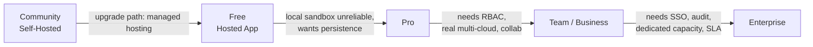

# 09.1 - Open-Core Business Model & Tiering Strategy

## Motivation

Running the DevOps Sandbox (LocalStack + `ubuntu_ssh_1` / `ubuntu_ssh_2`, see [[03.2 - DevOps Sandbox (LocalStack & SSH Containers)]]) inside InfraCanvas's own infrastructure for every free user is the single largest avoidable cost in the platform: it is CPU/RAM-heavy container compute with zero attached revenue. Relocating that compute onto the user's own machine, coordinated through a local **Sandbox Agent** bridged back to the hosted control plane (see [[03.6 - Remote Sandbox Agent & Bridging Connection Protocol]]), removes that cost almost entirely while still giving free users a fully working deploy-and-inspect loop.

This does not replace hosted sandboxing — it repositions it as a paid convenience (reliability, persistence, no local Docker requirement) rather than a free-tier cost center.

## Tier Ladder

| Tier | Compute for Sandbox | Real Cloud Deploy | Collaboration | Positioned As |
| :--- | :--- | :--- | :--- | :--- |
| **Community** (self-hosted, see [[09.2 - Repository & License Split Strategy (Open-Core vs Source-Available)]]) | Whatever the self-hoster provides | Yes, with own credentials | Single instance, self-managed | The open, forkable, run-it-yourself edition |
| **Free** (hosted app, local sandbox) | User's laptop, via CLI Sandbox Agent | No (sandbox-only) | Single user, capped team size | Zero-cost onboarding, zero-cost to InfraCanvas |
| **Pro** | InfraCanvas-hosted, persistent | Limited (single connected account) | Small team RBAC | "I don't want to run Docker / my laptop sleeps" |
| **Team / Business** | InfraCanvas-hosted fleet | Multi-cloud, full credential vault (see [[04.3 - AES-256-GCM Credential Vault & Fingerprinting]]) | Full RBAC, real-time collaboration | Teams shipping real infrastructure |
| **Enterprise** | Dedicated sandbox capacity, SLA | Unlimited, on-prem option | SSO/SAML, audit logs | Org-wide procurement |

Pricing figures are intentionally omitted here — this is a shape, not a price sheet. What matters architecturally is that every paid rung sells **reliability, persistence, and multi-user features**, not raw compute access, since raw compute is exactly the thing a technical user can get for free by running the CLI.

## Why This Satisfies the Original Four Goals

1. **Serves free users / developers** — the local Sandbox Agent replaces `git clone` + `npm run dev` + manually standing up LocalStack with one CLI command (see [[06.3 - Sandbox Agent CLI Commands (infracanvas sandbox)]]).
2. **No local dev environment required** — the user never touches InfraCanvas source; they run a distributed binary against their own Docker.
3. **Premium seat for power users** — hosted sandbox becomes a Pro-tier line item with a real, defensible value proposition (uptime, no local resource contention, no Docker Desktop licensing concerns — see [[08.4 - Local Sandbox Agent Rollout & Migration Plan]] for the Docker Desktop licensing caveat).
4. **Protects the core product from being cloned wholesale** — addressed structurally in [[09.2 - Repository & License Split Strategy (Open-Core vs Source-Available)]]: the Sandbox Agent and CLI are safe to open source because they contain no compiler or orchestration logic; the canvas compilers and Go runner orchestration engine stay behind a source-available license or fully closed, regardless of tier.

## Cost Model Sanity Check

The only ongoing marginal cost per free user under this model is:
- Control-plane API calls (project state, auth, RBAC) — already exists today, tier-independent.
- WebSocket relay bandwidth for log/status streaming through the Sandbox Agent Gateway (see [[03.6 - Remote Sandbox Agent & Bridging Connection Protocol]]) — bytes of text, not compute; cheap, but must be rate-limited per account to avoid becoming a new abuse surface (a free user could otherwise use the tunnel as a large-file relay if the Gateway is not scoped correctly).

Compare this to today's per-free-user cost: a running LocalStack container plus two Ubuntu SSH containers held on InfraCanvas's own hosts for the duration of any sandbox session. That is the delta this business model shift is designed to capture.

## Related Documents
- [[09.2 - Repository & License Split Strategy (Open-Core vs Source-Available)]]
- [[03.6 - Remote Sandbox Agent & Bridging Connection Protocol]]
- [[06.3 - Sandbox Agent CLI Commands (infracanvas sandbox)]]
- [[08.4 - Local Sandbox Agent Rollout & Migration Plan]]
- [[03.2 - DevOps Sandbox (LocalStack & SSH Containers)]]
