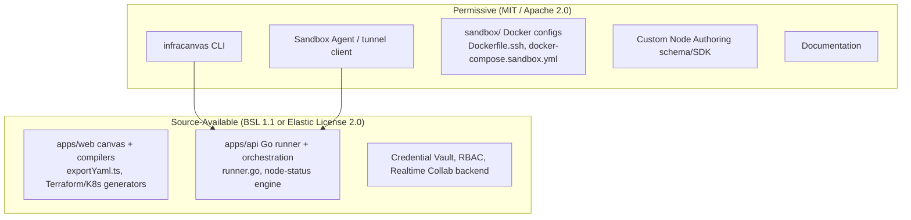

# 09.2 - Repository & License Split Strategy (Open-Core vs Source-Available)

## The Actual Question

"Open source, but competitors can't just fork it and compete with me" is not a contradiction — it is a licensing decision, and the decision has to be made about **which parts of the codebase** carry which license, before any code is published. Getting this backwards (publishing everything permissively, then trying to claw it back later) is the single most common mistake companies make here, and it has a well-documented failure mode.

## Cautionary Precedent (Read Before Deciding)

- **HashiCorp Terraform → OpenTofu**: HashiCorp relicensed Terraform from MPL 2.0 (permissive) to BSL (restrictive) in 2023, after years of community contribution under the open license. The community forked the last MPL-licensed commit into **OpenTofu**, now a Linux Foundation project and a direct competitor to Terraform itself.
- **Redis → Valkey**: Redis Labs relicensed from BSD to a more restrictive dual license in 2024. The community forked to **Valkey** (Linux Foundation), which is now shipped by AWS, Google Cloud, and others in place of Redis.
- **Elastic (Elasticsearch/Kibana) → OpenSearch**: Elastic relicensed away from Apache 2.0 in 2021; AWS forked the last Apache-licensed version into **OpenSearch**.
- **Tailscale client → Headscale**: the opposite failure mode — Tailscale open-sourced its *client* under BSD/MIT (reasonable, low-risk), but because the client-to-control-plane protocol was simple enough to reverse-engineer from the open client, the community built **Headscale**, a fully open-source reimplementation of Tailscale's *control plane* — the actual commercial product — as a free self-hosted alternative.

The lesson for InfraCanvas is symmetric: relicensing *more restrictively* after building a contributor community causes a fork of your own project (Terraform, Redis, Elastic pattern); open-sourcing a piece that's *simple enough to reveal the protocol of the paid product* invites a clean-room reimplementation of that product (Tailscale pattern). Given this project already generates Terraform/Ansible/Kubernetes configuration and simulates cloud infrastructure, the Terraform → OpenTofu case is the closest analog and worth taking seriously — pick a license posture now that can be sustained indefinitely, not one meant to be tightened later.

## Recommended Split

**Source-available, not permissive** (the compiler engines, the runner, the vault, the collaboration backend): visible on GitHub, freely self-hostable, freely modifiable, community can file issues and PRs — but the license (Business Source License 1.1 or Elastic License 2.0 are the two established options; both are non-OSI "source-available" licenses used respectively by HashiCorp's newer products, CockroachDB, MariaDB, and by Elastic itself post-relicense) explicitly prohibits offering the software as a competing hosted multi-tenant service. BSL additionally has a "Change Date" mechanism — the code can be set to automatically convert to a fully permissive license (e.g. Apache 2.0) after a fixed window (commonly 3-4 years), which is a credible long-term commitment to the community rather than a permanent lock-in, and defuses the "why should I contribute to closed code" objection.

**Fully permissive** (CLI, Sandbox Agent, sandbox Docker configs, node-authoring SDK, docs): this is exactly the surface area a technically careful developer needs to be able to *audit* before running it with Docker access on their own machine (see [[03.6 - Remote Sandbox Agent & Bridging Connection Protocol]]), and it is also the easiest surface area for outside contributors to meaningfully improve — new sandbox target types (e.g. a mock Azure or GCP target alongside the existing LocalStack/AWS one), new CLI subcommands, new community-contributed node definitions. None of it contains the compiler or orchestration logic that is the actual product.

## What This Buys Each Stated Goal

- **"More developers can join the project"** — satisfied for real: the CLI, Agent, and sandbox configs are genuinely useful open-source surface area with a low barrier to contribution, and the core engine is publicly readable (people can learn from it, propose fixes, understand how deploys work) even though it isn't relicensable by a competitor.
- **"I don't want to give away code that becomes direct competition"** — satisfied by the source-available terms on the canvas/compiler/runner/vault, not by hiding those files. Hiding them entirely would still leave the frontend JS bundle inspectable in any browser regardless (client-side code is never truly private), so source-available licensing is doing real work here that closed-source alone would not: it's a legal restriction on *hosting it as a service*, which is the actual threat, not a restriction on *reading it*.

## Governance Mechanics

- **Contributor License Agreement (CLA)**: require one on the source-available repo before merging outside PRs. This preserves the ability to dual-license or adjust terms later without re-negotiating with every past contributor — but see the precedent section above: a CLA gives *legal* flexibility to relicense, it does not remove the *community trust* cost of doing so. Use it to keep options open, not as a plan to tighten terms after adoption grows.
- **Two repos, not one repo with mixed licenses**: keep `infracanvas-cli` (MIT) and `infracanvas-sandbox-agent` (MIT) as separate public repositories from the core `infracanvas` (BSL/ELv2) monorepo, so the license boundary is structural (repo boundary) rather than something a contributor has to remember file-by-file inside one tree. This also lets the CLI/Agent repos build an independent contributor base without ever requiring core-repo access.
- **Public roadmap + CONTRIBUTING.md** on the permissive repos specifically — this is where "more developers join" actually happens in practice (small, well-scoped, mergeable PRs), not on the core compiler internals.

## Related Documents
- [[09.1 - Open-Core Business Model & Tiering Strategy]]
- [[03.6 - Remote Sandbox Agent & Bridging Connection Protocol]]
- [[06.3 - Sandbox Agent CLI Commands (infracanvas sandbox)]]
- [[01.2 - System Architecture & Monorepo Structure]]
